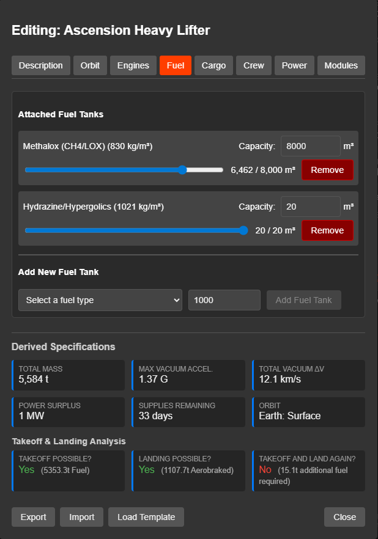

# Getting Started with the Star System Generator

Welcome to the Star System Generator! This application is a comprehensive toolkit designed to help Game Masters create, visualize, and manage scientifically-plausible star systems for sci-fi TTRPGs. Whether you run a hard-science campaign like *The Expanse*, a retro-future game like *Traveller* or *Mothership*, or space opera like *Star Wars*, this tool adapts to your needs.

## 1. The Starmap: Your Galactic Sector

When you launch the app, you start at the **Starmap View**. This is your sector map, tracking the relationships between different star systems.

*   **Navigation**: Click and drag to pan; scroll to zoom.
*   **Adding Systems**: Right-click anywhere on the grid to generate a new star system. You can customize the seed or star type later.
*   **Linking Systems**: Right-click a star and select "Link System", then click a second star to create a hyperspace lane or jump route between them.
*   **Settings**: Use the controls in the top-right to toggle the background image or switch grid styles (Square, Hex, or None) to match your game system's aesthetic.

## 2. The System View: Orbital Mechanics

Clicking on any star system zooms you into the **System Visualizer**. This is a real-time 2D orbital simulation.

*   **Focus**: Click on any planet, moon, or station to "focus" the camera on it. The side panel will update with its specific data.
*   **Time Control**: Use the play/pause buttons and time-scale slider to watch orbits evolve. You can fast-forward years in seconds to see alignment windows.
*   **Toytown View**: Real space is empty and boring. Use the "Toytown View" slider to artificially scale up planets and moons so you can see them relative to each other—perfect for getting a sense of "local space" without realistic distances making everything invisible dots.

## 3. Building Your Worlds

### Procedural Generation
If you don't like a system, use the **Regenerate Controls** at the top. You can roll a random system, pick a specific star type (e.g., "Type M Red Dwarf"), or start with an empty star and build from it manually. 

### Edit the Star System
1.  **Right-click** on any body (planet/moon) or clear space and select **"Add Planet Here"**.
2.  A planet will be created and you will be in Edit mode - adjust any planetary parameters and it will update physical & flight information correctly. You can fine tune position from here.
3.  **Customize or delete**: Once placed, click the construct and click **"Edit"** to open the **Construct Editor**.
### Artificial Constructs (Ships & Stations)
The generator isn't just for planets. You can populate your system with infrastructure.
1.  **Right-click** on any body (planet/moon) or clear space and select **"Add Construct Here"**.
2.  Choose from a library of templates inspired by *The Expanse*, *Aliens*, and *Hard Sci-Fi*.
3.  **Customize**: Once placed, click the construct and click **"Edit"** to open the **Construct Editor**. You can fine tune position from here.

*   **Flight Profile**: The editor calculates real Delta-V and TWR capabilities based on the installed engines and fuel. It will tell you if your ship can actually land on the planet it's orbiting!
*   **Modules**: Refit ships with different modules (Cargo Bays, Weapons, Sensors) to suit your campaign.

## 4. GM Tools & Narrative

This tool is built for Game Masters. We provide several ways to manage secrets and lore.

### Visibility Controls
You control what your players see.
*   **Object Visibility**: Click the **Eye Icon** next to an object's name to hide it completely (e.g., a hidden pirate base or a rogue planet).
*   **Description Visibility**: Inside the "Detailed Information" panel, click the eye icon next to the header to hide *just the text description* while keeping physical stats visible. Great for when players scan a planet (get the stats) but haven't visited it (don't know the lore).

### AI Descriptions
Stuck for ideas? The app integrates with **OpenRouter** to generate descriptions for you.
1.  Go to **Settings** on the main Starmap page and add your free OpenRouter API key.
2.  Select a body and click **"✨ Expand with AI"**.
3.  Choose a style (e.g., "Formal Survey", "Spacer Rumors") and let the AI write the lore for you.

### GM Quick Notes
Every object has a **GM Quick Notes** text area at the bottom of the sidebar. These notes are **always private**—they will never appear in Player Views or Player-facing reports.

## 5. At the Table: Digital Play (Projector Mode)

If you have a second screen or a projector at your gaming table, use the **Projector Mode**.
1.  Open the Hamburger Menu (☰) in the System View.
2.  Click **"Open Projector View"**.
3.  Drag this new window to your player-facing screen and make it fullscreen.

**Features:**
*   **Synced View**: It automatically follows your camera movements and focus.
*   **Spoiler-Free**: Hidden objects and GM notes are stripped out.
*   **CRT Mode**: Toggle the "Green-screen CRT Mode" in the menu for an immersive, retro-terminal aesthetic perfect for *Alien* or *Mothership* games.

## 6. At the Table: Analog Play (Paper Reports)

Prefer a low-tech table? You can generate physical handouts.
1.  Open the Hamburger Menu (☰).
2.  Click **"Generate Report"**.
3.  Choose your audience (**GM** for full intel, **Player** for redacted) and a visual theme (**Retro Line Printer** or **Corporate**).
4.  Print the result or save it as a PDF.

The **Player Version** automatically redacts hidden objects and descriptions marked as hidden, giving you a safe "sensor scan" handout to give to your crew.

## 7. Saving & Sharing

*   **Browser Storage**: Your work saves automatically to your browser.
*   **Download Starmap**: Export your entire sector as a JSON file for backup.
*   **Share Constructs**: You can export individual ship designs as small JSON files to share with other GMs or move between campaigns.