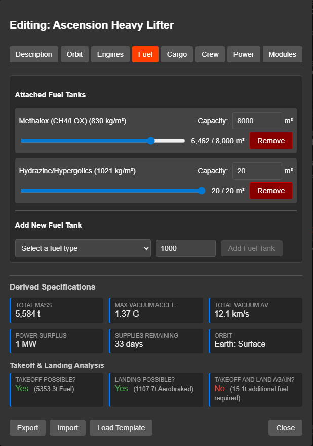

# Getting Started with Star System Explorer

Welcome! Star System Explorer is a toolkit for creating, visualising and running scientifically-plausible star systems for sci-fi TTRPGs. Whether you run hard science like *The Expanse*, retro-future *Traveller* or *Mothership*, or space opera like *Star Wars*, it adapts to your table.

📺 **[Watch the Tutorial Video](https://youtu.be/LrgNh2PVOlg)** to see it in action.

> **Tip:** almost anywhere in the app, the **apple icon** (the "Newton panel") shows the full working behind a body — every physics layer's inputs and outputs, and where each tag came from. It's the fastest way to understand *why* a world is the way it is. See §5.

## 1. The Starmap: your galactic sector

You start at the **Starmap** — a pan-and-zoom map tracking many star systems and the routes between them.

* **Navigate**: drag to pan, scroll to zoom.
* **Add systems**: right-click empty space to place a new system.
* **Link systems**: right-click a star → *Link System*, then click a second star to draw a jump route.
* **Find by tag…**: from the rail, hunt across every system for what you need — the nearest gas giant to refuel at, a world with a breathable atmosphere, or anything you've tagged.
* **Settings**: toggle the Milky Way backdrop, switch grid style (Square / Hex / None), pick metric or imperial units, and enable **Traveller mode** for hex alignment.

## 2. The System View: orbital mechanics

Click a system to drop into the **System Visualiser** — a real-time 2D orbital view.

* **Focus**: click any planet, moon or construct to centre the camera and open its data.
* **Time control**: play/pause and scrub the time slider to watch orbits evolve — fast-forward years to find alignment windows. Display Time (what you're scrubbing) and Actual Time (the committed "now") are independent.
* **Toytown view**: real space is mostly empty, so scale bodies up to see them relative to each other.
* **True-colour worlds**: bodies are drawn from their real physics — star light, surface liquids, haze and clouds, plus auroras, ice caps, cratering, volcanic hotspots, and visible oblateness on fast rotators.
* **Overlays**: turn on **Hill Spheres** to see each body's gravitational "grab" boundary (handy for placing moons), or use the **Measure** tool from the rail to read the straight-line distance between two bodies — it even tracks a moving ship.

## 3. Building your worlds

### Grow one procedurally
Use the generation wizard to build a system from scratch. Pick your star on a calibrated **Hertzsprung–Russell diagram**, and the engine grows plausible planets and belts around it — taking the star's and system's **age** into account (older systems have thinner belts, more stripped atmospheres, quieter tectonics). Push the sliders to coax out more exotic worlds. Multi-star systems are built as proper **binary hierarchies**, the only arrangement that's really stable.

### Or build by hand
1. **Right-click** a body or clear space → **Add Planet Here**. New planets bind to the dominant gravitational influence under your cursor.
2. You'll be offered **physically appropriate** planet choices to keep you plausible — pick one, then fine-tune.
3. Open the editor to adjust mass, radius and **interior makeup** (metal / rock / carbon / ocean / ice / gas). Density emerges from the composition, and dialling density toward ~1 g/cc turns a terrestrial into a gas giant. Rotation period and axial tilt have their own sliders (rotation snaps to tidal locking); spin a world fast enough and it visibly flattens.

Everything recomputes live: temperature, fluids, magnetosphere, geology, habitability and tags all update as you edit. Derived values you disagree with (albedo, radiogenic heating, magnetosphere) can be overridden — and those overrides drive the tags in turn.

## 4. Classification

Every world is classified into one of 50–60 planet types, each visualised and info-linked. When a call is **borderline** (the top two types score within 10% of each other), the Newton panel flags it and shows the competing fingerprints so you can **reclassify by hand** — a pinned type survives save and reload, while the panel still shows what the engine would have chosen.

The **Testion** demo system catalogues most of the possible types in one place if you want to browse them.

## 5. The Newton panel — "show the working"

Click the **apple icon** on any body to open the Newton panel. It lays out, layer by layer, how the body was derived: interior makeup → gravity → temperature and tidal heat → fluids → magnetism → geology → colour → habitability → stability, each with its inputs and outputs. It also lists every **tag** and the rule or physics that produced it. Each layer deep-links into the in-app **`/physics`** reference, which explains the models, the shortcuts taken, and the honest fudges.

It's both a teaching tool and a debugging tool — if a world surprises you, the panel tells you why.

## 6. Tags, Points & Constructs of Interest

Tags are now a first-class feature, and they're what give players reasons to *go* somewhere.

* **Physics tags** are auto-derived and locked (e.g. *Magnetism · Intrinsic dynamo*, *Shape · Oblate*).
* **Points of Interest (PoI)** are seeded by rules you configure in **Settings** — flavour and resources like fuel, science interest, mining, or plot hooks ("Why are we here?").
* **Constructs of Interest (CoI)** tag a ship's capabilities and role — its FTL drive and range, its fuels, its disposition — which engine descriptions and the autopilot then read.
* **Manual tags**: invent your own for any purpose and use them in PoI rules.
* **Packs**: author your own PoI/CoI packs to flavour a whole starmap — prison colonies on ore-rich moons, a slim chance of alien ruins on any terrestrial.

Use **Find by tag…** from the rail to filter bodies or constructs across systems. For a full tour, open the **Tags Guide** from the Find-by-tag panel.

## 7. Constructs: ships & stations

Populate your system with infrastructure.

1. **Right-click** a body or clear space → **Add Construct Here**.
2. Choose from a template library (*The Expanse*, *Aliens*, hard sci-fi, *Mothership*).
3. Click the construct → **Edit** to open the editor.

* **Flight profile**: real Δv and thrust-to-weight from the fitted engines and fuel — it'll tell you whether the ship can actually land on the planet it's orbiting.
* **Modules**: refit with cargo, weapons or sensors.
* **Custom images**: give a construct (or a body) its own picture — note that images grow your save file considerably.

### Autopilot
Give NPC ships standing orders so they run their own lives — **Mine, Transport, Patrol, Explore** or **Escort**. Set a ship's *character* (punctual or tardy, planning ahead or not, speed vs efficiency), turn on auto-refuel and restock, and let smart routing find and process resources using your PoI/CoI tags. The **Ship's Log** records everything — journeys, cargo, refuels, and any interactions with other constructs — and is the single source of truth for the physics and time engines. See the in-app **Autopilot Guide** for the full behaviour.

## 8. Transit & interstellar travel

* **In-system**: plan efficient transfers (Lambert solver) or hard burns for any ship, between moons of a planet or across the whole system. Journeys schedule against Display Time and execute as you advance the clock; transits are n-body aware, so they wiggle and may need correction fuel.
* **Interstellar**: fly between systems with a **Jump** drive (instant), or realistic reaction drives — including **relativistic** travel that shows crew-frame and observer-frame clocks diverging near light speed. Under-fuelled ships fall short and drift.
* **Drifting**: a ship stopped mid-flight can coast under gravity instead of halting — typically looping the sun for centuries until a planet slings it away.

## 9. GM tools & narrative

* **Visibility**: the eye icon hides a whole object (a hidden base, a rogue planet); a second eye inside the data panel hides *just the description* — so players who scan a world get stats but not lore.
* **AI descriptions**: add a free [OpenRouter](https://openrouter.ai/) key in Settings, select a body, and **✨ Expand with AI** to generate lore in a chosen style, guided by the body's tags.
* **GM Quick Notes**: a private note area on every object — never shown in Player Views or player reports.

## 10. At the table

### The Field Guide (players' own devices)
Serve your world live to players' phones and tablets. The **Field Guide** broadcasts a redacted catalogue in four skins — a retro monochrome terminal, a clean survey datapad, a starship console with an orbital map, and *The Guide* (colourful and friendly). Players see only what your visibility settings allow.

### Projector Mode (a shared screen)
Open the System View hamburger menu (☰) → **Open Projector View**, drag it to your player-facing screen and go fullscreen. It follows your camera, time and focus, strips hidden objects and GM notes, and has an optional CRT effect for that *Alien*/*Mothership* feel.

### Paper reports (low-tech tables)
Hamburger menu → **Generate Report** → choose **GM** (full intel) or **Player** (redacted) and a theme, then print or save as PDF. The Player version auto-redacts hidden objects and descriptions — a safe "sensor scan" handout.

## 11. Saving & sharing

* **Autosave**: your work saves to your browser automatically (nothing leaves your machine).
* **Download / Upload**: export your whole sector, or an individual system, as JSON — for backup or to share.
* **Player-Safe export**: share a spoiler-free copy that hides GM notes and hidden objects.
* **Credit your work**: save your name, contact and a version number into a system file (under the main star details) so you're credited when you share.
