# Getting Started with Star System Explorer

Star System Explorer is a toolkit for creating, visualising and running scientifically-plausible star
systems for science-fiction tabletop RPGs. Whether you run hard science like *The Expanse*,
retro-future *Traveller* or *Mothership*, or space opera like *Star Wars*, it adapts to your table.

This guide walks the app in the order you meet it. It describes V3 as it currently stands; the app is
in beta, so some of it will change.

> **The apple icon** — the "Newton panel" — appears on every body, and it shows the full working
> behind that world: every physics layer's inputs and outputs, and where each tag came from. It is
> the fastest way to understand *why* a world is the way it is. See section 6.

> **A note on the tutorial video.** There is one on YouTube, and it is well out of date: the ideas
> still hold, but almost every screen in it has changed. Useful for the shape of things, misleading
> on the detail. This guide is the current account.

---

## 1. Starting out

The first screen offers four ways to begin.

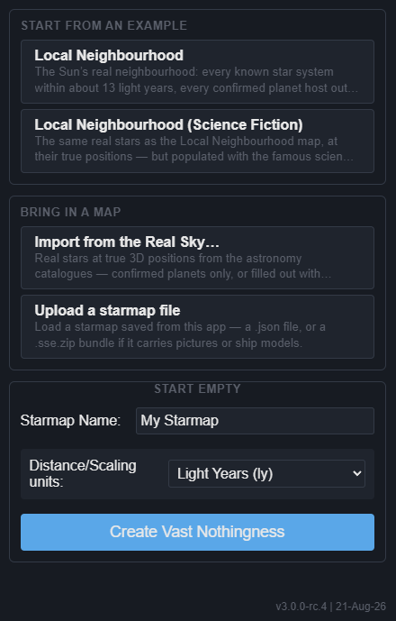

* **Start from an example.** Two starmaps ship with the app. **Local Neighbourhood** is the Sun's
  real neighbourhood: every known star system within about 13 light years, every confirmed planet
  host out to about 16.5, and a few famous landmarks beyond (Altair, Vega, Zeta Reticuli,
  TRAPPIST-1). Positions are true three-dimensional positions from Gaia, Hipparcos and SIMBAD;
  planets are those the NASA Exoplanet Archive lists as confirmed. **Local Neighbourhood (Science
  Fiction)** is the same real stars at the same real positions, tenanted by the famous fictional
  set — Sol runs on *The Expanse*, Pandora circles Alpha Centauri A, the *Nostromo* is still
  answering that beacon at Zeta Reticuli. Stars with no famous tenant keep their real planets.
* **Import from the Real Sky.** Build a map straight from the astronomy catalogues. See section 2.
* **Upload a starmap file.** A `.json` file, or a `.sse.zip` bundle if the campaign carries pictures
  or ship models. Both load; the app works out which it has been given.
* **Start empty.** Name the map and choose its distance unit — light years, parsecs, or
  **diagrammatic** if you would rather the map were a schematic than a scale drawing.

A **welcome list** summarises what is new in V3, and **Browse all guides** opens the Help hub, which
is also under **Help** in the left rail: this guide, the in-app tags and autopilot guides, the
`/physics` reference, and the changelog.

---

## 2. The starmap

The starmap is a pan-and-zoom map of many star systems and the routes between them.

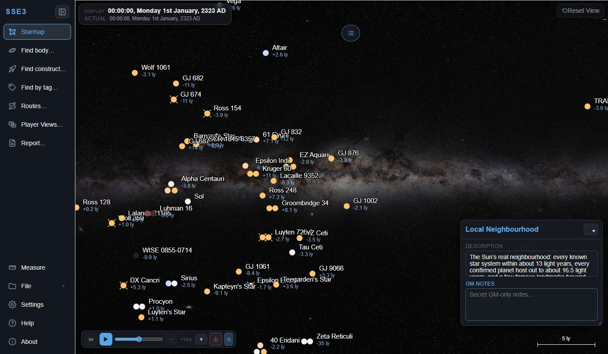

* **Navigate.** Drag to pan, scroll to zoom. On a phone or tablet, drag to pan and pinch to zoom.
  **Reset View** fits everything.
* **The picker.** The puck at the top of the map opens a searchable list of every system and ship.
  Tap it, type, pick, and it folds away again. The padlock keeps it open.
* **Depth is real.** Every system carries a z-coordinate, so the number under a star's name is how
  far in front of or behind the map plane it sits, and distances are measured in three dimensions.
  If you would rather work flat, **Settings > Starmap > Ignore depth when measuring distances**
  turns depth into decoration and stops the map annotating it.
* **The floating panel** holds the map's **Description** and your **GM Notes**, both editable in
  place. Drag its header to move it, or the corner grip to make it bigger.
* **The left rail** carries **Find body**, **Find construct**, **Find by tag**, **Routes**,
  **Player Views**, **Report** and **Measure**, with File, Settings, Help and About beneath.

### Adding systems

Right-click empty space (long-press on touch):

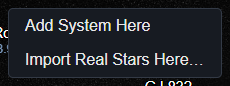

* **Add System Here** opens the two-step **New system** wizard — see section 4.
* **Import Real Stars Here…** drops a real region of sky into the map you already have.
* With **Traveller mode** on, two more appear: **Add Traveller UWP Here** and **Add Traveller Map
  SubSector Here**, which pulls a whole subsector from [travellermap.com](https://travellermap.com).

Right-click a system for **Rename**, **Set Depth**, **Add System near here…** (place a new system by
bearing, elevation and distance from this one), **Start Link** (then click a second star to draw a
jump route) and **Delete**.

### Importing the real sky

**Import from the Real Sky** — from the start screen, or from the map's right-click menu — builds a
region from the astronomy catalogues. Two things are worth knowing, and they are independent of one
another:

* **You get every star in the region, not only the ones with known planets.** A star with no
  confirmed planets is a normal result — and most of them are. Sol is included when the region
  reaches it, and Alpha Centauri arrives with A, B and Proxima.
* **Filling out is a separate, opt-in choice.** Left alone, you get exactly what the catalogues
  record and nothing invented. Turn it on and the app fills in plausible worlds around the stars
  that have none, using the same generation dials described in section 4. Anything invented is
  tagged `origin/generated`, so you can always tell what is real.

Four presets are offered — **Local Neighbourhood** (16.5 ly), **Extended Neighbourhood** (30 ly, a
few hundred systems), **Around TRAPPIST-1** (somebody else's neighbourhood, with no Sol in it because
the region does not reach us), and **Sagittarius A\*** — or set your own centre and a radius between
4 and 41 light years. The panel counts what you are about to import as you drag, and says when a
region is getting big enough to hurt.

Where a star has no measured parameters, the figures shown are **typical for its class rather than
observed**, and the app says so rather than implying a measurement. A star's luminosity class is
read where the catalogue states it, so Antares arrives as the red supergiant it is rather than as a
red dwarf that happens to share its colour.

### Settings that shape the map

**Settings > Starmap** holds the map's own appearance: the distance unit and scale bar, the system
edge (a star's Hill limit, or a distance you choose), the snap grid (None, Square, Hex, Subsector
hex or Traveller hex), **Traveller mode**, an overall **Star size** dial, and **Star size by class**
— which spreads the star glyphs by luminosity class, remnants and sub-dwarfs smallest, then dwarfs,
giants and supergiants. At zero they are all the same size. Black holes keep their own glyph
whatever you choose. Each player view carries its own copy of that dial, on its Starmap step.

### Centring the map on a star

By default the starmap's distance rings radiate from the map's own origin, which on a map built from
real sky positions is rarely anywhere interesting. **Right-click any star and choose Centre Map
Here.** Reset View then frames that star, zoomed so every other star still fits, and the distance
rings measure *from it* — so they read as "ten parsecs from Sol" rather than from a point in empty
space. **Clear Map Centre** puts it back.

The choice is saved with your campaign and travels to player views.

### Stars that show what they are

Three things a star does are drawn on the map rather than badged onto it, on the GM starmap, the
player starmaps and the system view alike, and all three are derived from the star's own numbers:

* **Flares** licking off the limb of an *active* or *flare-star* star. A quiet one has none.
* **Jets** — a pair of collimated beams along the magnetic axis, from a fed black hole, a neutron
  star or a magnetar.
* **A shed shell** of wind around an evolved star: a halo on a giant, a shell on a supergiant.

You cannot switch these on from the map. The way to remove one is to remove the tag on the star's
Tags tab; the way to earn one is to change the numbers that derive it — feed the hole, or swell the
star. The Tags Guide has the detail.

### Your own map behind the stars

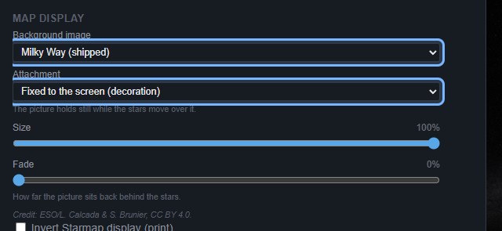

**Settings > Starmap > Map display** puts a picture behind the stars. The choice that matters is
**Attachment**, not the sliders:

* **Fixed to the screen** is decoration. The picture holds still while the stars move over it. The
  shipped Milky Way works this way.
* **Fixed to the map** pins the picture to map coordinates, so a system sits on the same point of
  the picture at every zoom. This is what you want for a sector map or a set of empire borders. It
  appears on the GM map, on the player 2D and 3D maps, and in the figure at the foot of a text map.

The width is given in **the campaign's own distance unit**, not in light years. Placement is done by
eye: **Align & scale on the map** hands the map back to you with live sliders. If you are uploading
a background, tick **Full resolution** under **Player Views > edit a preset > General > Graphics
library** — the default 512px is a blur once you zoom in. A background travels inside a `.sse.zip`
bundle along with its credit and appears in `ATTRIBUTIONS.md`, so record a credit for anything you
did not draw yourself. The About box credits whichever image is actually on screen.

### Interface skins

**Settings > System > Appearance** picks an **interface skin** for this device: **Modern** (the
default — compact type, light-blue highlights), **Classic** (the original warm orange on
near-black), **Clarity** (colour-blind-friendly chrome on the Okabe–Ito palette, with contrast
turned up) and **Nebula** (indigo rail, deep-blue panels, orchid accent). **Make your own** opens a
skin editor: pick a base, name it, and repaint twelve chrome colours with the app itself as the live
preview. Your skins live on your device and sit in the same picker.

A skin repaints the interface. The **colour palette** page below it goes finer, one colour at a
time — including the ones that carry meaning, like body types and zone bands — and its changes sit
on top of whichever skin you are wearing. A skin is chrome and stays on this device; it is not part
of the campaign and your players do not inherit it.

---

## 3. The system view

Click a system to drop into the **system visualiser** — a real-time orbital view.

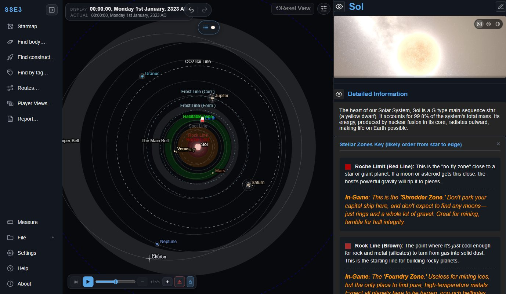

* **Focus.** Click any planet, moon or construct to centre the camera and open its data. Drag to pan,
  scroll or pinch to zoom, here and on the 3D view as well.
* **Time.** Play/pause, and drag the **shuttle** to jog forwards or backwards from one minute per
  second up to ten years per second. The shuttle is momentary: push it, let go, and it springs back
  to a stop. **Scrubbing while time is running does not stop the clock** — you seek to wherever you
  jog to, and playback carries on from there. **Display Time** (what you are looking at) and
  **Actual Time** (the committed "now") are independent, and the red button that commits one to the
  other asks first.
* **The floating controls.** The time transport and the picker behave identically wherever you meet
  them. A slim handle on the left moves them, and the position is remembered; the padlock on the
  right locks one open. Unlocked, a control folds away to a puck as soon as you touch something
  else, which is how you keep a tablet screen clear.

### Display options

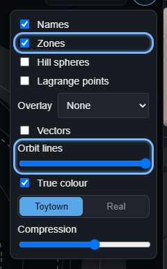

* **Zones** draws the stellar zones on the map, and the panel opens a key explaining each: the Roche
  limit, the rock and soot lines, the habitable zone, **two frost lines** — where ice could have
  formed when the system was born, and where ice is stable today — and the CO₂ ice line.
  The habitable zone comes with a caveat worth repeating: its outer half assumes a thick
  carbon-dioxide greenhouse, so a thin-aired world out there is frozen. That is why Mars sits inside
  the Sun's band and is a desert of ice.
* **Hill spheres** shows each body's gravitational grab boundary, which is what you want when
  placing moons. **Lagrange points** marks the five of the body you have focused, against its host.
* **Overlay** puts a grid over the system: square, hex, subsector hex, Traveller hex, polar, or
  polar with scale rings. The rings land on round numbers.
* **Orbit lines** can be dimmed or switched off entirely with the dial beside it — worth having on
  an imported system with seventy orbits in it. There are three of these controls and they are not
  the same: this one is yours and affects your screen only; each player view has its own on its
  System step, which travels to the player's window; and **Player Views > Quick overrides** has a
  momentary **Hide orbit lines** that is gone on reload.
* **True colour** draws each world from its own physics rather than as a coloured disc.
* **Toytown / Real** is about **spacing**, not size. Real is true linear AU, so the inner system is
  a dot. Toytown compresses the spacing — with its own Compression dial — so the whole system fits
  one screen while keeping the order and the rough proportions.
* **Measure**, from the rail, reads the straight-line distance between two bodies, and tracks a
  moving ship.

### Lagrange points, and putting things in them

Every planet has five points where its pull and its star's balance out. Switch **Lagrange points**
on from the display options and they are drawn as the shapes the physics actually makes, not as
five dots: **L4 and L5** get their true tadpole regions — the long curved lobes that trojan asteroids
really occupy, leading and trailing the planet by sixty degrees — while **L1, L2 and L3** get
station-keeping envelopes, because nothing sits still at those three without spending fuel.

A faint dashed circle runs through all five: the co-orbital track, meaning "the distance the planet
is at right now". On an eccentric orbit the points ride in and out with it, so the track leaves the
drawn orbit line and that is correct rather than a glitch.

**Right-click inside any zone to put something there.**

- At **any of the five**, you can park a construct. A station at L1 or L2 is doing real work to stay
  there, and its tags say so.
- At **L4 or L5**, you can also settle a world — a trojan, sharing the planet's orbit sixty degrees
  ahead or behind. The body picker opens with a mass ceiling for that particular pair, because a
  trojan only stays put while it is light enough relative to the planet and the star.

The mass ceiling is a guide, not a gate: place something too heavy and it goes where you put it,
and the physics tags it as unstable rather than refusing you. That is the same bargain as everywhere
else in the editor — author freely, and the engine tells you honestly what it thinks.

A **binary** can sit at a Lagrange point too, and it is judged on two questions a single body is
never asked: whether the point can hold the pair, and whether the pair holds together while it is
there.

Ships can fly to any of the five, and arrive matching the point's motion rather than merely reaching
its position.

### Where a world can actually orbit

Two overlays answer the question "could something sit *there*?", and both are drawn from the same
physics that judges a world once you place one.

**Hill spheres** mark each body's gravitational hold — the bubble inside which it keeps a companion
rather than losing it to whatever it orbits. Switch them on from the display options. They draw for
the selected body's neighbourhood — itself, its parent, its siblings and one level down — rather
than for everything at once, so picking Earth shows you Luna's without filling the screen with the
rest of the system.

**A pair of stars, or any two bodies sharing a barycentre, clears a surprisingly large hole around
itself and holds a stable ring beyond it.** Both edges are worked out and drawn, in their own pink
shade alongside the Hill spheres. The inner edge is real physics rather than a stylistic margin: a
world too close to a pair gets thrown out, and the boundary sits at roughly two to four times the
separation between them, depending on how eccentric the pair is and how the mass is split. Beyond
the outer edge the pair's grip gives out and the world belongs to whatever the pair itself orbits.

**Right-click inside the ring to put a body there.** You are offered a mass ceiling rather than a
hard rule — the stability model assumes the newcomer is light enough not to disturb the pair, and it
tells you where that assumption stops holding rather than refusing the placement.

Hierarchical triples get theirs too: Alpha Centauri, Polaris and Algol are each an inner pair with a
third star further out, and the ring is drawn for the inner pair.

Generated systems respect the same boundary — the generator no longer seeds planets into the hole.

### Five ways to look at a world

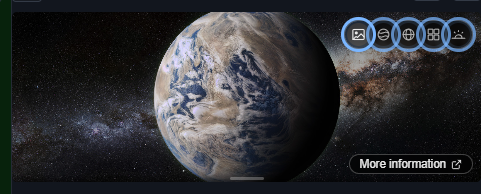

Every world's panel offers up to five views, and which ones appear depends on what the physics has
derived for it:

* **Type** — the artist's impression for this world's type (or your own uploaded picture).
* **2D** — the world as the orrery draws it, from its own physics.
* **3D** — the world as a globe; drag to spin it.
* **Colours** — familiar colours as they look under this world's own daylight.
* **Surface view** — standing on it: this world's own ground, sky and light, and how far you can
  see. A red dwarf's noon does not look like ours, and this answers how far your players can see and
  how far a lamp carries in metres rather than in adjectives. A gas giant has nothing to stand on,
  so its surface view is the view from a balloon.

A star has the first three; a belt or a ring has none of them, because a swarm portrayed alone is
the one picture nobody needs.

### Reading the numbers

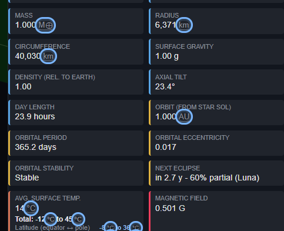

**Click a unit to change it.** The unit label beside any value — a temperature, a mass, a radius, an
orbit, a delta-v — is a button. Click it and every reading of that kind on that body type follows,
everywhere: flip one planet's temperature to Fahrenheit and every planet and moon shows Fahrenheit,
while stars stay in kelvin until you flip one of those. Mixing is fine, the choices save with the
campaign, and player views inherit them — players see your units and cannot change them.

The orbital rows include **Next Eclipse**: when a moon next crosses its sun, and how much of it is
covered. It is worked out with the orbital elements held fixed and no nodal precession, so read it
as *when they next line up* rather than as an ephemeris; the row's own tooltip says so.

The **Ascent** row is deliberately answered rather than hidden. A belt or a ring says *not
applicable — debris spread round an orbit, with no surface to leave*, and a gas or ice giant says
*no solid surface to lift from*, where both used to show a meaningless figure.

---

## 4. Building your worlds

### Grow one procedurally

**Add System Here** on the starmap opens a two-step wizard.

**Step 1 — pick your star or stars.** Load one of the bundled example systems, load a system you
saved earlier (an SSE `.json` or `.sse.zip`, a Universe Sandbox `.ubox`, or a SpaceEngine `.sc`), or click a
calibrated **Hertzsprung–Russell diagram** to place stars yourself. Add more than one and they nest
into a proper **binary hierarchy** — the only arrangement that is really stable — shown as you build
it: a binary, an Alpha-Centauri-like triple, an Epsilon-Lyrae double-double.

**Step 2 — set the age and the physical character.** The age slider is bound to the star's own life,
running from the youngest it could plausibly be to just before it swells, explodes or collapses,
with a marker at the young end where its dynamo is still violent enough to flare. Then four dials:

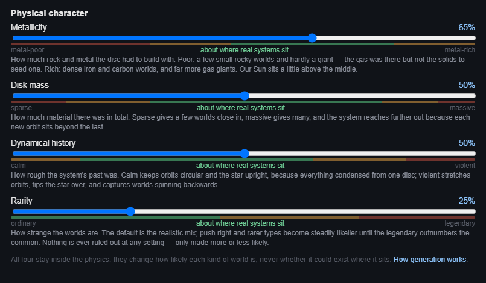

* **Metallicity** — did the disc have the material? Poor gives a few small rocky worlds and hardly a
  giant; rich gives dense iron and carbon worlds and far more gas giants.
* **Disk mass** — how much was there in total? This changes the system's *size*, not what its worlds
  are made of: more planets means the chain reaches further out.
* **Dynamical history** — how rough was the past? Calm keeps orbits circular and the star upright;
  violent stretches orbits, tips the star over, and captures worlds spinning backwards.
* **Rarity** — how strange should this be? The default sits at the realistic mix, a quarter of the
  way along rather than in the middle, because below it a system only gets duller.

The coloured strip under each dial is a **realism band**: green where reality supports the setting,
amber where it is possible but unlikely, red where nothing measured looks like it — with a one-line
verdict. **It marks how unusual a setting is, never what is allowed.** Nothing is forbidden at any
position, and the band edges are rule-pack data, so a GM running a deliberately fantastical setting
can move the goalposts rather than fight them. All four dials change how *likely* each kind of world
is, never whether it could exist where it sits. **How generation works** under the dials opens the
physics page's account of them.

**Character presets** set all four at once (Calm & mature, Violent migration, Ancient & fading, Young
& fiery, Exotic zoo), and a **naming** scheme decides whether the system reads as a catalogue entry,
a scientific designation or a proper name.

The same four dials appear wherever an import can be filled out — a Universe Sandbox or SpaceEngine
file, a Traveller UWP, a real-sky region — so what you learned building a system from a star is what
you know when filling out an imported one. The catalogue path deliberately has no age slider, since
a region of sky holds stars of every age, and the Traveller panel appears once the UWP asks for more
than the main world.

Imported worlds are truth: they are never moved, re-typed or re-aged, and a generated world that
would crowd one is dropped rather than the import. The imported star is truth too — only the worlds
generated into the system are born into the era you chose.

### Or build by hand

1. **Right-click** a body or clear space and choose **Add Planet Here** (or **Add Moon Here**). New
   bodies bind to the dominant gravitational influence under your cursor. A planet added this way
   lands in the inner system with an atmosphere, and works on a system with no planets yet.
2. You are offered **physically appropriate** choices for that orbit — types whose own declared
   bands the slot actually satisfies, judged on temperature, mass, age, tidal lock and, for a moon,
   the fit to its host. The gates sit at the top of the picker as switches, and you can turn any of
   them off to see the wider menu *despite* the physics. Hand authoring is hand authoring, and the
   tags will say what is implausible about the result.
3. Open the editor to adjust mass, radius and **interior makeup** (metal / rock / carbon / ice /
   gas). Oceans are modelled separately, as surface or subsurface fluid layers, not as an
   interior-makeup slider. Density emerges from the composition, and dialling density toward
   ~1 g/cc turns a terrestrial into a gas giant. Rotation period and axial tilt have their own
   sliders — rotation snaps to tidal locking — and a world spun fast enough visibly flattens.
4. If the physics will not give you the world you want, the **Overrides** tab (the last one) lets you
   pin the figure by hand and keep everything downstream honest. See below.

Everything recomputes live: temperature, fluids, magnetosphere, geology, habitability and tags all
update as you edit.

### Editing an atmosphere

Open a body's **Atmosphere** tab and expand **Advanced Composition Editor** to set the mix gas by
gas. Two things about the controls are worth knowing, because atmospheric chemistry lives at the
small end and a linear control cannot reach it.

**The sliders are logarithmic**, across eight decades. That is deliberate: what matters physically
is the RATIO, not the difference. Taking hydrogen from 90% to 99% barely moves the mean molecular
weight, while taking ammonia from 0.1% to 1% can form an entire cloud deck. A log axis gives equal
travel to equal ratio change, so a trace gas gets as much of the slider as the bulk gas does.

**Below 1% the readout switches to parts per million**, because 2.82 ppm is a number you can read
and type and 0.000282% is not. The unit shown beside each box tells you which one you are in, and
it follows the value rather than being a mode you set — slide a gas up past 1% and it changes to a
percentage on its own. Type a value in whatever unit is showing, or **add a `%` or `ppm` suffix to
force the other one**: sitting at 0.9% and typing `2` means 2 ppm, while typing `2%` means two per
cent.

The slider bottoms out at a very small but non-zero value: a log scale cannot reach zero. To remove
a gas entirely, use the **x** button on its row.

Changing one gas redistributes the difference across the others and renormalises, so the mix always
sums to 100%. If you want a species at an exact figure, set it last.

### Breaking the physics on purpose — the Overrides tab

The last tab in the body editor, after Tags. Everything on it is a number the engine normally works
out for itself, and pinning one **changes the physics rather than the label**: your figure is fed
*into* the derivation, so everything downstream of it follows honestly. Pin a moon out past the ice
line at 1100 K and its ice does not survive, its clouds change, its type and habitability move, and
its picture changes with them.

* **Bond albedo**, including *negative* — a surface that returns more energy than its star sends it.
* **Surface temperature** — the mean. The day and night sides keep their swing about it.
* **Bulk density** — mass, radius and density are one relation with two free numbers, so pinning
  density pins the second and you say which of mass and radius gives way. Hold the radius and a
  hollow world looks exactly the same size and weighs a fraction of what it should. The composition
  is left alone deliberately, and gravity and escape velocity follow the new mass.
* **Atmospheric pressure** — erosion stops eating it, so a small world can hold air it could never
  have kept.
* **Magnetosphere** — a field far beyond what the interior could generate is kept and drives the
  shielding, and is called anomalous rather than reported as an ordinary dynamo.
* **Radiogenic heat**, **thermal inflation**, and on a star its **magnetic activity** — the flare
  and X-ray output, which is set by the dynamo rather than by brightness.

**Nothing is refused.** Each row shows the range it expects, lets you type well past either end, and
says in plain words what is wrong with the figure once you do — the same "kept and labelled" rule the
star editor has always followed. **Reset to calculated** hands the quantity straight back.

The slider tells you where you are: **green** is where the physics would have put it, **amber** is
implausible for that world, **red** is impossible for anything — a negative albedo is energy from
nowhere, while a 70-tesla terrestrial merely has no known mechanism. A mark on the track shows the
engine's own answer, which is what Reset returns to. Anything you have pinned is flagged
**OVERRIDDEN** on the body's card, so a glance tells you which worlds you have leaned on.

Every pin can be given a **reason** from the Anomaly tag category — Precursor Engineering, Exotic
Matter, Nanite Ecology, Magic, or one you write on the spot. The tag your players see names what it
is accounting for (*Alien Technology: Anomalous magnetosphere, surface temperature*), so a reading that looks
wrong points at the thing that is wrong with it. Keep a reason secret if you would rather they
worked it out, or give none at all and the world simply looks the way you made it.

### Editing the rules everything is built from

The physics reads a **rule pack**, and the parts of it that matter most to a setting are editable in
the app. **Settings > Planets** opens **Atmospheres**, **Liquids** and **Biospheres**; **Settings >
Tech** opens **Fuel & Drives** and **Sensors**; **Settings > Tagging** owns the tag categories and
their rules.

* **Atmospheres.** Each gas carries its **absorption bands** — three numbers apiece: a centre, a
  width and a strength, in nanometres — describing *where in the spectrum that gas eats incoming
  light*. That is what decides the light reaching the ground, what a plant would have to live on, and
  the colour of the sky from below; a gas with no bands only scatters. **Rayleigh** is its scattering
  strength relative to nitrogen (CO₂ scatters about 2.4 times as hard, hydrogen about a fifth), which
  is why a thick CO₂ sky is not simply a thicker blue one. The card is deliberately split into
  **Derivation — what the physics reads** and **Presentation — how it is drawn**, and **nothing under
  Presentation feeds the physics**: the surface-light chain never reads a gas's colour. Under
  *Atmospheres > Reactions* you can also define what combines with what — ammonia and hydrogen
  sulphide into the compound that colours Jupiter's belts, or krypton and unobtanium into pink
  bubblegum clouds, which the model will take you at your word about.
* **Biospheres.** What each life morphology looks like, how much ground it covers by default, the
  order it paints in, and the pigments a world's light can favour. Each morphology also has a **light
  colour** — what the night side glows: bioluminescence, city amber, somebody's purple arc-light.
  Left unset it is the sodium amber it has always been.
* **Fuel & Drives.** An engine definition can carry an **exhaust colour**, which tints the drive plume
  of any ship fitted with it, on the map and in the model preview.

Nothing here is a database. Only the handful of entries worth caring about are defined, and the rest
is yours to invent.

---

## 5. Classification

Every world is classified into one of 50–60 planet types, each visualised and info-linked. When a
call is **borderline** — the top two types score within 10% of each other — the Newton panel flags it
and shows the competing fingerprints, so you can **reclassify by hand**. A pinned type survives save
and reload, and the panel still shows what the engine would have chosen.

The **Testion** demo system catalogues most of the possible types in one place if you want to browse
them.

### Stars

A star's type is read from its **physics**, not stored as a label — so a designation like `G2V` means
something you can check. The letter and number come from its temperature; the roman numeral says how
big it has grown for that temperature, which is what separates a dwarf from a giant of the same
colour. The dropdown names each one in plain words with a famous example (`G V — Main-sequence dwarf
(yellow) · the Sun`), and the panel says the same thing underneath in a sentence.

**Picking a spectral type draws a star from that class's range** rather than handing back its exact
middle, so two G dwarfs are not identical — and the draw is seeded from the star, so it never rerolls
under you. L, T and Y dwarfs have real figures of their own in the rule pack rather than falling back
to something Sun-like.

Because it is derived, **the type follows what you edit**: drag the temperature and the star walks
along the spectral sequence; make it hugely larger and it becomes a giant. If your numbers describe a
star that could not exist — a B-type dragged down to a hundredth of the Sun's mass, say — you still
get it, with a red **Physically implausible** tag naming the law it breaks. The engine will never
GENERATE such a star; it simply does not stop you making one.

Two figures are worth knowing apart, because they are different things:

* **Luminosity** is how bright the star is, worked out from its size and temperature.
* **Ionising output** is the X-ray and ultraviolet radiation that strips atmospheres, and it follows
  the star's **magnetic field** instead. A flare barely changes brightness and changes this a
  thousandfold. Slide the magnetic field and watch it climb out of the normal band into the flaring
  one — until it saturates, which the panel tells you, because real stars have a ceiling.

Cool giants are the exception worth expecting: past a point a swollen, cool star stops holding a hot
corona at all, so a red giant is a far gentler neighbour than its size suggests, and an active red
dwarf is a far harsher one than its dimness suggests. The same two quantities set the **kill and
danger zones** drawn on the orbital slider and the system map, which is why a quiet cool dwarf's is
narrow and a hot star's is very wide.

---

## 6. The Newton panel — "show the working"

Click the **apple icon** on any body to open the Newton panel. It lays out, layer by layer, how the
body was derived: interior makeup, gravity, spin, albedo, temperature and tidal heat, fluids, clouds,
magnetism, radiation, aurora, geology, volatiles, surface features, the light reaching the ground,
the biosphere, apparent colour, habitability and orbital stability — each with its inputs and
outputs. It also lists every **tag** and the rule or physics that produced it. Each layer deep-links
into the in-app **`/physics`** reference, which explains the models, the shortcuts taken, and the
honest fudges.

It is both a teaching tool and a debugging tool: if a world surprises you, the panel tells you why.

---

## 7. Tags

Tags are the layer between the physics and everything that reads it — the panels, the map, your
players, the autopilot. If the engine knows something about a world, it says so as a tag.

There is **one** tagging system throughout. (Earlier versions had separate "Points of Interest" and
"Constructs of Interest"; those are gone, and everything they did is a tag with a category.)

* **Derived tags** come from the physics — *Magnetism · Intrinsic dynamo*, *Shape · Oblate* — and are
  re-derived whenever the numbers change, so they cannot drift out of step with the world.
* **Your own tags** sit alongside them. Invent any you like, on any object.
* **Overrides.** Disagree with the engine? Add a tag by hand in one of the engine's own namespaces
  and your answer wins: it survives every re-derive, suppresses the derived tag it replaces, and
  drives everything the real one drives, including the visuals and the rules. That changes the *tag*;
  to change the *number* behind it, pin the value on the body editor's Overrides tab instead.
* **Anomaly** is the one category that works differently: its tags are assigned to a pinned value as
  its stated reason, not added to a world by hand, and the tag names the readings it accounts for.
* **Secret tags** are yours alone and never reach a player view, a shared catalogue or a printed
  report.
* **Colour and highlights.** Give a tag its own colour and light up every body carrying it, right up
  to a roll-up on the starmap showing which systems hold what.
* **Rule packs** seed tags across a whole starmap — prison colonies on ore-rich moons, a slim chance
  of alien ruins on any terrestrial — and you can author your own.

Use **Find by tag** from the rail to filter bodies or constructs across systems. For the full tour,
open the **Tags Guide** from the Find-by-tag panel or from Help.

---

## 8. Constructs: ships and stations

Populate your system with infrastructure.

1. **Right-click** a body or clear space and choose **Add Construct Here**.
2. Choose from a template library (*The Expanse*, *Aliens*, hard sci-fi, *Mothership*).
3. Click the construct and open the editor.

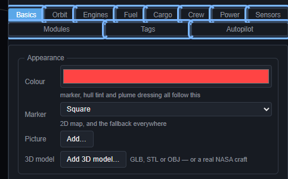

* **Flight profile.** Real Δv and thrust-to-weight from the fitted engines and fuel, so the panel can
  tell you whether the ship can actually land on the planet it is orbiting — and why not, when it
  cannot.
* **Modules.** Refit with cargo, weapons or sensors.
* **Custom images.** Give a construct, a planet or a **star** its own picture, with its credit,
  licence and source recorded alongside it. Removing an uploaded picture hands the body back to the
  one the engine derives — the planet's type image, or the star's spectral-class portrait.
* **3D models.** Give a ship an actual hull. Upload a GLB, STL or OBJ and it is converted, simplified
  if it is heavy, and shown as a turntable in the info block — then as a real craft on the 3D map,
  with a drive plume scaled to how hard it is burning. Six public-domain NASA craft ship as starter
  hulls, and seven finishes are offered — flat with panel lines, panelled hull, weathered, cel
  shaded, brushed metal, iridescent and blueprint. STL and OBJ arrive without colour and take the
  ship's own. A model leads the picture chain (model, then photo, then glyph) on player and GM
  surfaces alike, travels inside your saves, and
  reaches remote players over the broadcast automatically. The import dialogue asks you to align the
  hull by its **main drive** — the orange arrow, engines aft — because the map flies a ship nose-first
  and flips it for a braking burn. The model dialogue is big enough to fly around: drag to orbit,
  wheel or pinch to zoom, and **click the hull to place a drive** where you want the plume to come
  from. A ship's drawn size follows the same rule a planet's does, from a readable marker at one end
  of the size dial to true 1:1 at the other, with the icon standing in when the hull falls below about
  ten pixels; and a hull adopts the map's render style, including the occluding wireframe.

### Autopilot

Give NPC ships standing orders so they run their own lives — **Mine, Transport, Patrol, Explore** or
**Escort**. Set a ship's *character* (punctual or tardy, planning ahead or not, speed against
efficiency), turn on auto-refuel and restock, and let smart routing find and process resources using
your tags. The **Ship's Log** records everything — journeys, cargo, refuels, and any interactions
with other constructs — and is the single source of truth for the physics and time engines. See the
**Autopilot Guide**, under Help, for the full behaviour.

---

## 9. Transit and interstellar travel

* **In-system.** Plan efficient transfers (a Lambert solver) or hard burns for any ship, between
  moons of a planet or across the whole system. Journeys schedule against Display Time and execute as
  you advance the clock; transits are n-body aware, so they wiggle and may need correction fuel.
* **Interstellar.** Fly between systems with a **Jump** drive (instant), or realistic reaction drives
  — including **relativistic** travel that shows crew-frame and observer-frame clocks diverging near
  light speed. Under-fuelled ships fall short and drift.
* **Drifting.** A ship stopped mid-flight can coast under gravity instead of halting — typically
  looping the sun for centuries until a planet slings it away.

---

## 10. GM tools and narrative

* **Visibility.** The eye icon hides a whole object (a hidden base, a rogue planet); a second eye
  inside the data panel hides *just the description*, so players who scan a world get stats but not
  lore.
* **AI descriptions.** Add a free [OpenRouter](https://openrouter.ai/) key under **Settings > System
  > LLM Settings**, select a body, and **Expand with AI** generates lore in a chosen style, guided by
  the body's tags.
* **GM Quick Notes.** A private note area on every object, never shown in player-facing views or
  player reports.

---

## 11. Undo and redo

Everything you change inside a system can be taken back: bodies, constructs, tags, GM notes and
descriptions — and, on the starmap, moving, renaming, adding and deleting systems, the routes, and
the map's own description and notes.

* The keys are **Ctrl/Cmd+Z** and **Ctrl+Shift+Z** or **Ctrl+Y**, except inside a text box, where
  they still edit the text — that is the browser's own undo, and it is the right one there.
* A floating pill appears at the top of the view once there is something to wind back, and each step
  is **named**: *Undo: Mass of Earth*.
* **One drag of a slider is one step.** Rapid changes collapse together rather than filling the stack
  with a hundred entries.
* **The last twenty steps survive a reload.** They are saved with the campaign in this browser.
* **They are dropped when you switch to another system**, because a system's history is meaningless
  against a different system.
* **They never leave this browser.** The history is stripped out of every file you export and
  everything your players receive. An undo log records what you deleted; a save is a file you hand to
  other people.

Two things are **not** covered: player-view presets and campaign settings, and the camera and the
clock. And one thing is worth expecting — an undo restores the values you **authored** and lets the
engine re-derive the rest, so a class or a tag can come back as what the physics now implies rather
than exactly what was on screen before the edit.

---

## 12. At the table

### Player views

Design what your players see, and serve it live to their own devices or to a screen at the table.

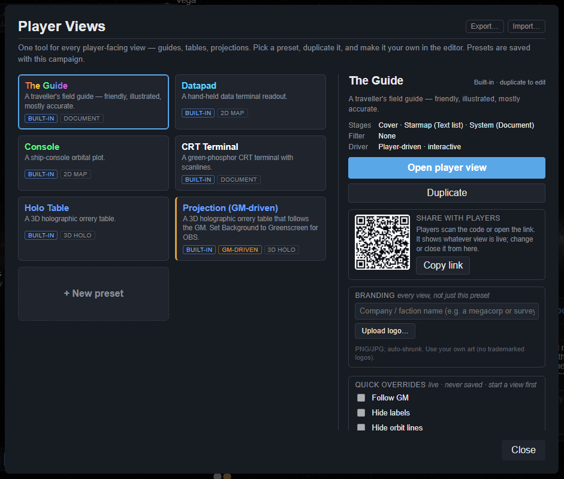

A player view is a **preset you build**: whether it shows the system in 3D, a flat orrery, a
document, a text list or the starmap; what it follows; how much of the panel furniture appears; and
what it is dressed in. Six presets ship with it — **The Guide** (a traveller's field guide, friendly
and illustrated), **Datapad**, **Console**, **CRT Terminal**, **Holo Table** and **Projection
(GM-driven)**, which follows the GM's camera, time and focus and can be set to a greenscreen
background for OBS. Duplicate one and it is yours to edit; the editor runs in six steps — General,
Cover, Starmap, System, Transitions and Visual filter.

Some preset controls are worth knowing about before you go hunting for them. The **System** step
carries the campaign's own night sky — the systems on your starmap standing in as real stars behind
the 3D view — with a **Star boost** and a **Name size** for it. Push star boost high and the
brightness is deliberately oversaturated: at that end it stops reading as apparent magnitude, which
is the point of it. Both steps have a **Grid falloff**, which fades a grid toward its edge instead of
cutting it off, and the System step has its own orbit-line dial and the highlighted-tag marker shape,
size and text. The **Starmap** step has the star-size-by-class dial and its own label size. Under
**Transitions**, *Terminal Clear* and its siblings dress a change of scene.

Everything is redacted against your visibility settings, and it updates live as you play, so moving
the clock or focusing a world moves it on their screens too. **Open player view** starts one;
players join by scanning the **QR code** or opening the **link**. Presets are saved with the
campaign, and **Branding** — a company or faction name and your own logo — applies to every view
rather than just the one. **Quick overrides** are live and never saved: Follow GM, Hide labels, Hide
orbit lines.

Or open a second browser window and drag it to a player-facing screen, which is the shared-screen
case.

**If a player's device cannot connect**, the cause is usually the network rather than the app.
Player views connect peer-to-peer, and that works on home and mobile networks by itself — a public
relay is built in. A workplace network that blocks UDP can stop it, and then a relay that speaks TLS
on port 443 is needed. **Settings > System > Remote players** takes your own STUN/TURN servers, one
per line, and they ride in every player link and QR you share from then on.

### Paper reports

**Report** from the rail, then choose **GM** (full intel) or **Player** (redacted), whether to
include constructs, and one of three visual themes — Retro Line Printer, Corporate / Industrial or
Standard Clean. Then print it, or save it as a PDF. The player version auto-redacts hidden objects
and descriptions, which makes it a safe "sensor scan" handout.

---

## 13. Saving and sharing

* **Autosave.** Your campaign saves to this browser automatically. Browsers may clear that storage
  when space runs low; **Settings > System > Your data** shows how much you are using and can ask the
  browser to keep it — but the browser decides, so that lowers the risk rather than removing it.
  **Saving to a file is the only real backup.**
* **Two different things to save, and the screen says which.** Saving from the starmap writes your
  **whole campaign** — every system and the routes between them. Saving from inside a system writes
  **that one system only**, and says so: your other systems and the map they sit on are not in that
  file. Both screens show the filename they will write (`-Starmap` or `-System`), so the two are
  told apart at a glance later.
* **Give a loader the wrong file and it says what the file is.** Drop a campaign on **Load System**
  and it is named as a campaign, with an offer to open it as one — stating plainly that doing so
  replaces the campaign you have open. Drop a single system on **Load Starmap** and it is named as a
  system, pointing you at the door that takes it. This works by looking inside the file, so a
  renamed one is still recognised.
* **Download and upload.** Export your whole sector, or an individual system. A plain map saves as
  **JSON**, exactly as it always did. A map carrying **assets** — ship models, uploaded pictures, a
  map background — saves as a **`.sse.zip` bundle** instead: readable JSON with the assets beside it
  as real files. You can open one with any zip tool and look inside, or hand-edit it. Both load; the
  app decides by the zip magic number rather than by the file name, so a renamed file still works.
  **A save carries what you authored, not what the engine derived from it** — the derived figures are
  recomputed when the file is loaded, which is why saves are a third to a half smaller than they were
  and why a file can never carry stale physics.
* **Player-Safe export.** Share a spoiler-free copy that hides GM notes and hidden objects.
* **Credit your work.** Save your name, contact and a version number into a system file, under the
  main star's details, so you are credited when you share it.
* **Attributions.** A bundle carries an `ATTRIBUTIONS.md` listing every model and picture in it with
  its credit, licence and source — and it names anything whose provenance is missing, so a
  share-alike image cannot travel without its credit by accident. Uploaded models, body photos and
  construct pictures each have their own credit, licence and source fields.

**What leaves your machine.** Your campaign never does: it is stored in this browser and goes
nowhere unless you export it. Two things do go out, and both are worth stating plainly. Searching
for a star by name queries the SIMBAD service live, and a Traveller subsector import fetches from
travellermap.com — those requests carry what you typed, not your campaign. And the hosted site
records **one anonymous visit event per browser per day** through Vercel Web Analytics, keeping a
single timestamp in this browser under `sse-analytics-last-sent` so it does not count you more often
than that. Nothing about your campaign is included. Player views are peer-to-peer between your
device and your players'.

---

## 14. When something goes wrong

It is a beta, so occasionally it will. These are the tools for it.

* **A map that will not load.** If a load never finishes, the app notices next time and offers a way
  out instead of trying again forever: **try loading again**, **start without loading it**, **download
  a copy** straight from storage, or save a diagnostic file. The download works even when the map
  cannot be drawn, so a campaign is recoverable from a file that will not open. The screen names the
  point it stopped at.
* **Stop load.** The loading screen shows how many systems it has re-derived, names the one it is
  working on, and offers **Stop load**, which takes effect at the end of the current system. So if it
  stalls, the name on screen is the culprit — and stopping offers the diagnostic file straight away.
* **Memory.** **Settings > System > Memory** shows how much memory this tab is using against the
  limit the browser will allow, and warns you in good time to save if it climbs. Saving your campaign
  to a file and reloading the tab is the reliable way to bring it down. (Chrome and Edge only — other
  browsers do not publish the figure, and the panel says so rather than guessing.)
* **Reporting a problem.** **Settings > System > Reporting a problem** builds a small zip: what the
  app was doing, how far a load got, timings, your device and browser, and a copy of your starmap so
  the problem can be reproduced. It is built only when you ask, it saves to your own machine, nothing
  is uploaded anywhere, and the `README.txt` inside tells you exactly what it contains and which
  files you may delete if you would rather not share the campaign. It doubles as a backup, so it is
  worth keeping either way. **A frozen tab cannot report itself — this is how we see what happened.**
* **Ships drawing at the wrong size on the 3D map.** Setting `window.__shipDebug = true` in the
  browser console makes the focused ship print its real drawn size and its facing chain once a
  second. Useful to quote in a bug report.
* **Starting over.** **Settings > System > Danger zone > Clear all data** wipes everything this app
  has stored in this browser and reloads as a brand-new user. It cannot be undone, so export first.

Post a diagnostic file to the [Discord](https://discord.gg/UAEq4zzjD8) with a note about what you
were doing. It is the fastest way to get a fault fixed.
