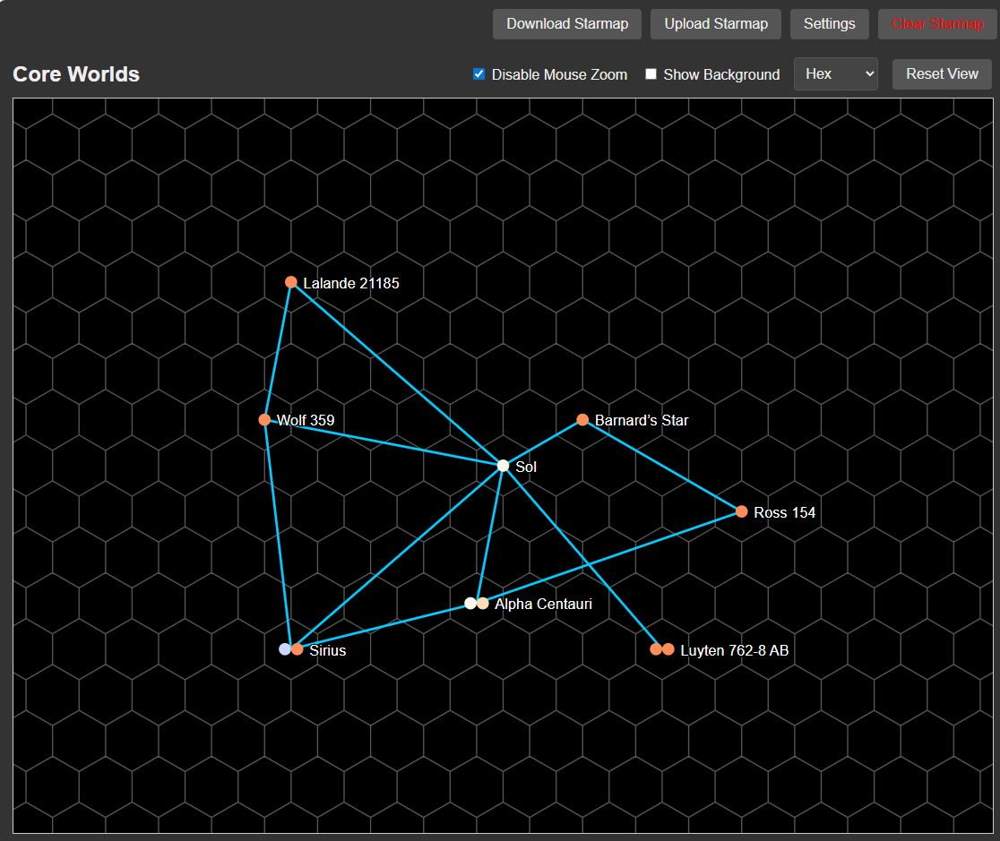
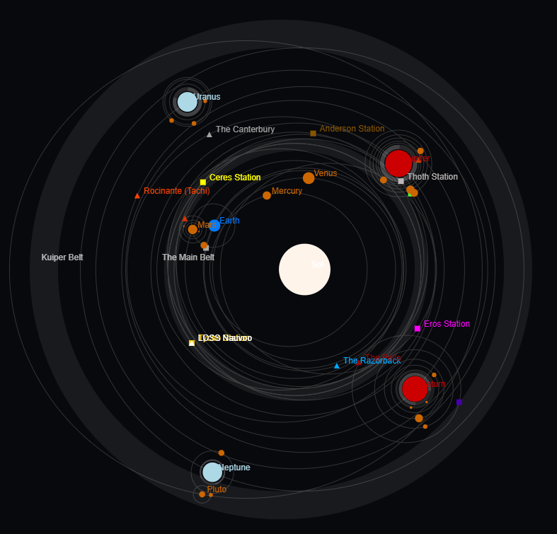
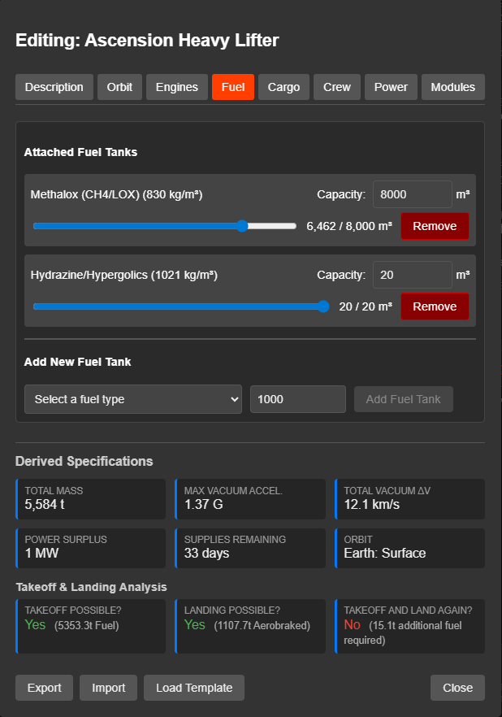
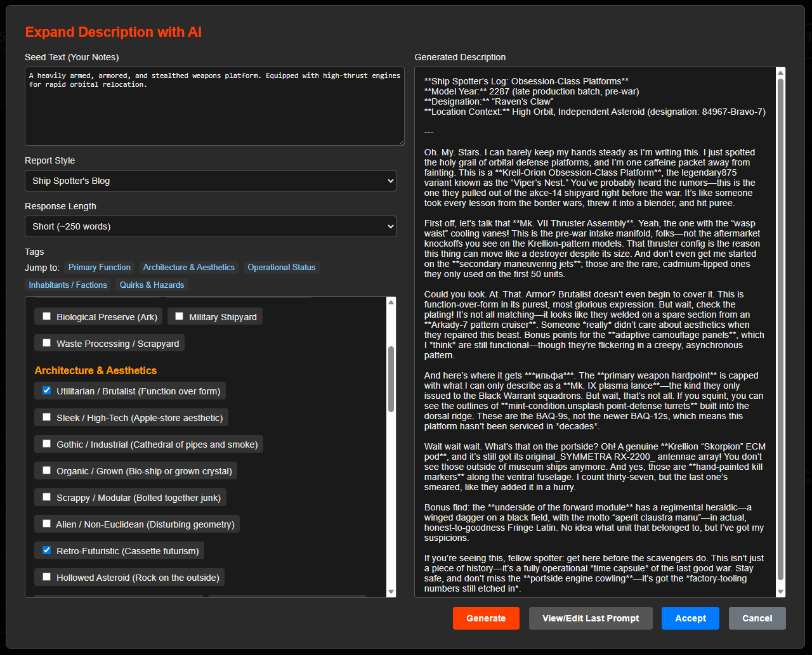
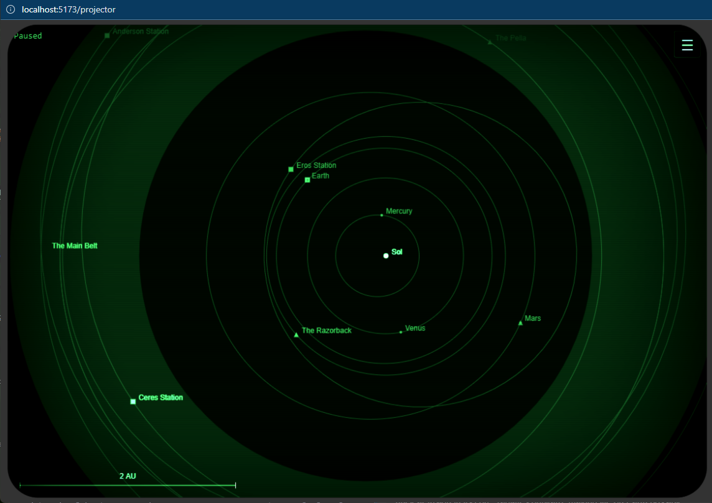
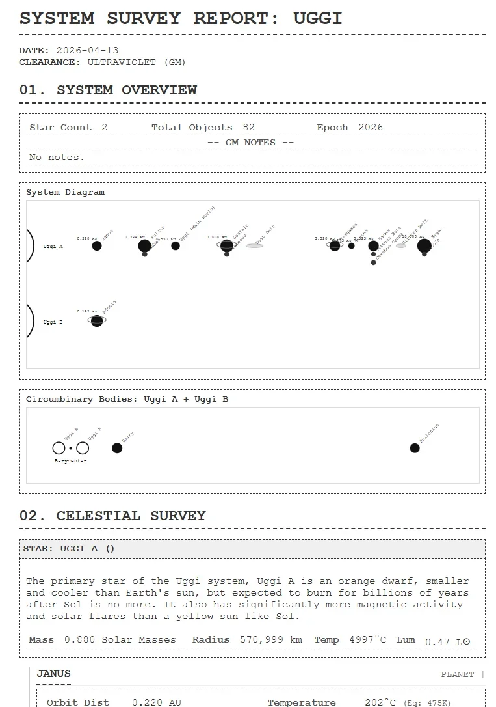

# Getting Started with Star System Explorer

Welcome! Star System Explorer is a toolkit for creating, visualising and running scientifically-plausible star systems for sci-fi TTRPGs. Whether you run hard science like *The Expanse*, retro-future *Traveller* or *Mothership*, or space opera like *Star Wars*, it adapts to your table.

📺 **[Watch the Tutorial Video](https://youtu.be/LrgNh2PVOlg)** to see it in action.

> **Tip:** almost anywhere in the app, the **apple icon** (the "Newton panel") shows the full working behind a body — every physics layer's inputs and outputs, and where each tag came from. It's the fastest way to understand *why* a world is the way it is. See §5.

## 1. The Starmap: your galactic sector

You start at the **Starmap** — a pan-and-zoom map tracking many star systems and the routes between them.

* **Navigate**: drag to pan, scroll to zoom.
* **Add systems**: right-click empty space to place a new system. In the **New System** dialogue you can also **import** a Universe Sandbox save (`.ubox`) or a SpaceEngine export (`.sc`) — pick the file, choose how many small bodies to include with the mass slider, and review the diff before loading.
* **Import the real sky**: build a map from the astronomy catalogues instead. Start a new starmap and
  choose **Import from the Real Sky**, or right-click empty space on an existing map and pick
  **Import Real Stars Here…** to drop a real region into it. You get the actual stars of a region at
  their true three-dimensional positions, carrying the planets we have really found — and, if you
  want them, plausible generated worlds filled in around the rest. Anything the app invented is
  tagged as generated, so you can always tell what is real. The bundled starmaps are built this way.
* **Link systems**: right-click a star → *Link System*, then click a second star to draw a jump route.
* **Find by tag…**: from the rail, hunt across every system for what you need — the nearest gas giant to refuel at, a world with a breathable atmosphere, or anything you've tagged.
* **Find a system**: the **picker** — the puck at the top of the map — opens a searchable list of every system and ship. Tap it, pick, and it folds away again.
* **Describe the map**: the floating panel holds the map's **Description** and your **GM Notes**, both editable in place. Drag its header to move it, or the corner grip to make it bigger when you have more to say than fits.
* **Settings**: toggle the Milky Way backdrop, switch grid style (Square / Hex / None), pick metric or imperial units, enable **Traveller mode** for hex alignment, and choose whether **depth** counts toward distances — when it doesn't, the map stops annotating it.

## 2. The System View: orbital mechanics

Click a system to drop into the **System Visualiser** — a real-time 2D orbital view.

* **Focus**: click any planet, moon or construct to centre the camera and open its data.
* **Time control**: play/pause and scrub the time slider to watch orbits evolve — fast-forward years to find alignment windows (the first time you press **+**, playback starts so you immediately see it move). Display Time (what you're scrubbing) and Actual Time (the committed "now") are independent.
* **The floating controls**: the time transport and the picker behave identically wherever you meet them. A slim handle on the left moves them and the position is remembered; the padlock on the right locks one open. Unlocked, a control folds away to a puck as soon as you touch something else — which is how you keep a tablet screen clear. Unlocking puts it away too, so the padlock is also the "done with this" button.
* **Toytown view**: real space is mostly empty, so scale bodies up to see them relative to each other.
* **True-colour worlds**: bodies are drawn from their real physics — star light, surface liquids, haze and clouds, plus auroras, ice caps, cratering, volcanic hotspots, and visible oblateness on fast rotators.
* **Overlays**: turn on **Hill Spheres** to see each body's gravitational "grab" boundary (handy for placing moons), or use the **Measure** tool from the rail to read the straight-line distance between two bodies — it even tracks a moving ship.

## 3. Building your worlds

### Grow one procedurally
Use the generation wizard to build a system from scratch. Pick your star on a calibrated **Hertzsprung–Russell diagram**, and the engine grows plausible planets and belts around it — taking the star's and system's **age** into account (older systems have thinner belts, more stripped atmospheres, quieter tectonics). Push the sliders to coax out more exotic worlds. Multi-star systems are built as proper **binary hierarchies**, the only arrangement that's really stable.

### Or build by hand
1. **Right-click** a body or clear space → **Add Planet Here**. New planets bind to the dominant gravitational influence under your cursor.
2. You'll be offered **physically appropriate** planet choices to keep you plausible — pick one, then fine-tune.
3. Open the editor to adjust mass, radius and **interior makeup** (metal / rock / carbon / ice / gas). Oceans are modelled separately, as surface or subsurface fluid layers, not as an interior-makeup slider. Density emerges from the composition, and dialling density toward ~1 g/cc turns a terrestrial into a gas giant. Rotation period and axial tilt have their own sliders (rotation snaps to tidal locking); spin a world fast enough and it visibly flattens.

Everything recomputes live: temperature, fluids, magnetosphere, geology, habitability and tags all update as you edit. Derived values you disagree with (albedo, radiogenic heating, magnetosphere) can be overridden — and those overrides drive the tags in turn.

## 4. Classification

Every world is classified into one of 50–60 planet types, each visualised and info-linked. When a call is **borderline** (the top two types score within 10% of each other), the Newton panel flags it and shows the competing fingerprints so you can **reclassify by hand** — a pinned type survives save and reload, while the panel still shows what the engine would have chosen.

The **Testion** demo system catalogues most of the possible types in one place if you want to browse them.

### Stars

A star's type is read from its **physics**, not stored as a label — so a designation like `G2V` means
something you can check. The letter and number come from its temperature; the roman numeral says how
big it has grown for that temperature, which is what separates a dwarf from a giant of the same
colour. The dropdown names each one in plain words with a famous example (`G V — Main-sequence dwarf
(yellow) · the Sun`), and the panel says the same thing underneath in a sentence.

Because it is derived, **the type follows what you edit**: drag the temperature and the star walks
along the spectral sequence; make it hugely larger and it becomes a giant. If your numbers describe a
star that could not exist — a B-type dragged down to a hundredth of the Sun's mass, say — you still
get it, with a red **Physically implausible** tag naming the law it breaks. The engine will never
GENERATE such a star; it simply does not stop you making one.

Two figures are worth knowing apart, because they are different things:

* **Luminosity** is how bright the star is, worked out from its size and temperature.
* **Ionising output** is the X-ray and ultraviolet radiation that strips atmospheres, and it follows
  the star's **magnetic field** instead. A flare barely changes brightness and changes this a
  thousandfold. Slide the magnetic field and watch it climb out of the normal band into the flaring
  one — until it saturates, which the panel tells you, because real stars have a ceiling.

Cool giants are the exception worth expecting: past a point a swollen, cool star stops holding a hot
corona at all, so a red giant is a far gentler neighbour than its size suggests, and an active red
dwarf is a far harsher one than its dimness suggests.

## 5. The Newton panel — "show the working"

Click the **apple icon** on any body to open the Newton panel. It lays out, layer by layer, how the body was derived: interior makeup → gravity → temperature and tidal heat → fluids → magnetism → geology → colour → habitability → stability, each with its inputs and outputs. It also lists every **tag** and the rule or physics that produced it. Each layer deep-links into the in-app **`/physics`** reference, which explains the models, the shortcuts taken, and the honest fudges.

It's both a teaching tool and a debugging tool — if a world surprises you, the panel tells you why.

## 6. Tags

Tags are the layer between the physics and everything that reads it — the panels, the map, your
players, the autopilot. If the engine knows something about a world, it says so as a tag.

There is now **one** tagging system throughout. (Earlier versions had separate "Points of Interest"
and "Constructs of Interest"; those are gone, and everything they did is a tag with a category.)

* **Derived tags** come from the physics — *Magnetism · Intrinsic dynamo*, *Shape · Oblate* — and are
  re-derived whenever the numbers change, so they cannot drift out of step with the world.
* **Your own tags** sit alongside them. Invent any you like, on any object.
* **Overrides**: disagree with the engine? Override a derived tag and your answer wins. The app
  remembers that it was your call, not its own.
* **Secret tags** are yours alone and never reach a player view.
* **Colour and highlights**: give a tag its own colour and light up every body carrying it, right up
  to a roll-up on the starmap showing which systems hold what.
* **Rule packs** seed tags across a whole starmap — prison colonies on ore-rich moons, a slim chance
  of alien ruins on any terrestrial — and you can author your own.

Use **Find by tag…** from the rail to filter bodies or constructs across systems. For the full tour,
open the **Tags Guide** from the Find-by-tag panel.

## 7. Constructs: ships & stations

Populate your system with infrastructure.

1. **Right-click** a body or clear space → **Add Construct Here**.
2. Choose from a template library (*The Expanse*, *Aliens*, hard sci-fi, *Mothership*).
3. Click the construct → **Edit** to open the editor.

* **Flight profile**: real Δv and thrust-to-weight from the fitted engines and fuel — it'll tell you whether the ship can actually land on the planet it's orbiting.
* **Modules**: refit with cargo, weapons or sensors.
* **Custom images**: give a construct, a planet or a **star** its own picture, with its credit,
  licence and source recorded alongside it. Removing an uploaded picture hands the body back to the
  one the engine derives — the planet's type image, or the star's spectral-class portrait.
* **3D models**: give a ship an actual hull. Upload a GLB, STL or OBJ in the construct editor and it
  is converted, simplified if it is heavy, and shown as a turntable in the info block — then as a
  real craft on the 3D map, with a drive plume scaled to how hard it is burning. Pick from seven
  finishes, or use one of the public-domain NASA craft that ship with the app. STL and OBJ arrive
  without colour and take the ship's own. Models travel with your saves and reach remote players
  automatically.

### Autopilot
Give NPC ships standing orders so they run their own lives — **Mine, Transport, Patrol, Explore** or **Escort**. Set a ship's *character* (punctual or tardy, planning ahead or not, speed vs efficiency), turn on auto-refuel and restock, and let smart routing find and process resources using your PoI/CoI tags. The **Ship's Log** records everything — journeys, cargo, refuels, and any interactions with other constructs — and is the single source of truth for the physics and time engines. See the in-app **Autopilot Guide** for the full behaviour.

## 8. Transit & interstellar travel

* **In-system**: plan efficient transfers (Lambert solver) or hard burns for any ship, between moons of a planet or across the whole system. Journeys schedule against Display Time and execute as you advance the clock; transits are n-body aware, so they wiggle and may need correction fuel.
* **Interstellar**: fly between systems with a **Jump** drive (instant), or realistic reaction drives — including **relativistic** travel that shows crew-frame and observer-frame clocks diverging near light speed. Under-fuelled ships fall short and drift.
* **Drifting**: a ship stopped mid-flight can coast under gravity instead of halting — typically looping the sun for centuries until a planet slings it away.

## 9. GM tools & narrative

* **Visibility**: the eye icon hides a whole object (a hidden base, a rogue planet); a second eye inside the data panel hides *just the description* — so players who scan a world get stats but not lore.
* **AI descriptions**: add a free [OpenRouter](https://openrouter.ai/) key in Settings, select a body, and **✨ Expand with AI** to generate lore in a chosen style, guided by the body's tags.
* **GM Quick Notes**: a private note area on every object — never shown in player-facing views or player reports.

## 10. At the table

### Player Views (phones, tablets, a shared screen)
Design what your players see, and serve it live to their own devices or to a screen at the table.

A player view is a **preset you build**: choose whether it shows the system in 3D, a flat orrery or
the starmap; what it follows; how much of the panel furniture appears; and dress it in a look that
suits your setting — a monochrome terminal, a survey datapad, a starship console, a CRT with scan
lines. Everything is redacted against your visibility settings, and it updates live as you play, so
moving the clock or focusing a world moves it on their screens too.

Open **Player Views** from the menu, build a preset, and send the link — or open a second window and
drag it to a player-facing screen for the shared-screen case.

> The older **Field Guide** and **Projector Mode** have been removed. Player Views does everything
> they did and rather more, and every look they offered ships as a preset — the monochrome terminal,
> the survey datapad, the starship console, The Guide, the holo table, and the overhead projection.
> Old `/catalogue?theme=...` and `/projector` links no longer work; open the view you want from
> Player Views and share the link it gives you.

### Paper reports (low-tech tables)
Hamburger menu → **Generate Report** → choose **GM** (full intel) or **Player** (redacted) and a theme, then print or save as PDF. The Player version auto-redacts hidden objects and descriptions — a safe "sensor scan" handout.

## 11. Saving & sharing

* **Autosave**: your work saves to your browser automatically (nothing leaves your machine).
* **Download / Upload**: export your whole sector, or an individual system, for backup or to share.
  A plain map saves as JSON, exactly as it always did. A map carrying **assets** — ship models,
  uploaded pictures — saves as a **`.sse.zip` bundle** instead: readable JSON with the assets beside
  it as real files. You can open one with any zip tool and look inside. Both load; the app works out
  which it has been given, so you never have to choose.
* **Player-Safe export**: share a spoiler-free copy that hides GM notes and hidden objects.
* **Credit your work**: save your name, contact and a version number into a system file (under the main star details) so you're credited when you share.
* **Attributions**: a bundle carries an `ATTRIBUTIONS.md` listing every model and picture in it, with
  its credit, licence and source — and it names anything whose provenance is missing, so a
  share-alike image cannot travel without its credit by accident. Uploaded models and pictures each
  have their own credit, licence and source fields.

## 12. When something goes wrong

It is a beta, so occasionally it will. These are the tools for it.

* **A map that will not load.** If a load never finishes, the app notices next time and offers a way
  out instead of trying again forever: reload it, start without it, or **download a copy** straight
  from storage. That last one works even when the map cannot be drawn, so a campaign is recoverable
  from a file that will not open.
* **Stop load.** The loading screen names the system it is working on and lets you stop between
  systems — so if it stalls, the name on screen is the culprit.
* **Memory.** **Settings → System → Memory** shows how much your browser is using against its limit,
  and warns you in good time to save if it climbs. (Chrome and Edge only — other browsers do not
  publish the figure, and the panel says so rather than guessing.)
* **Reporting a problem.** **Settings → System → Reporting a problem** builds a small zip you can
  send us: what the app was doing, how far a load got, your device and browser, and the map itself.
  It is built only when you ask, it is saved to your own machine, nothing is uploaded anywhere, and
  the README inside tells you exactly what it contains and which files you may delete if you would
  rather not share the campaign. **A frozen tab cannot report itself — this is how we see what
  happened.**
