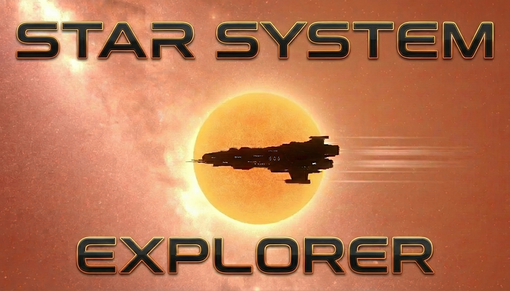
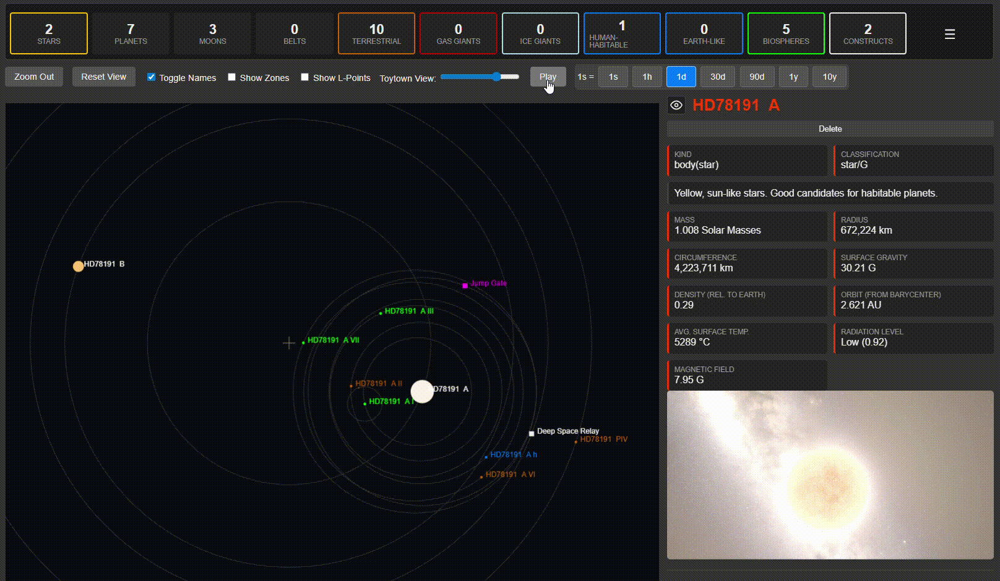
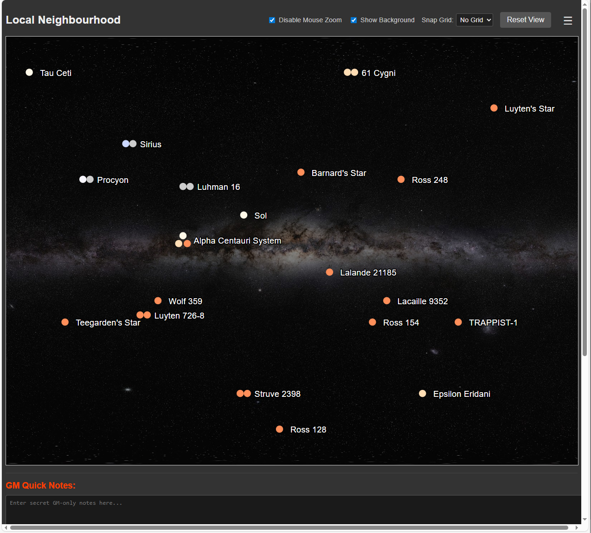
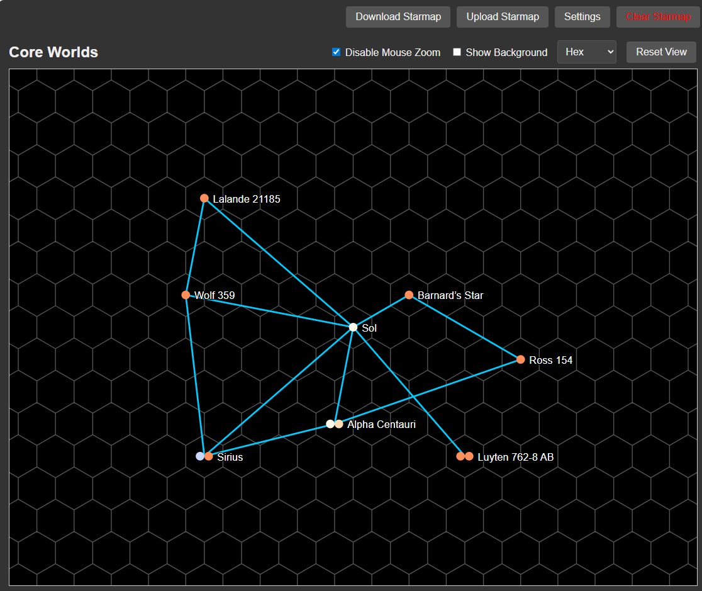
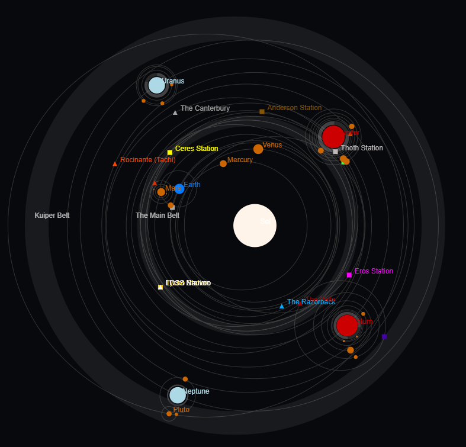
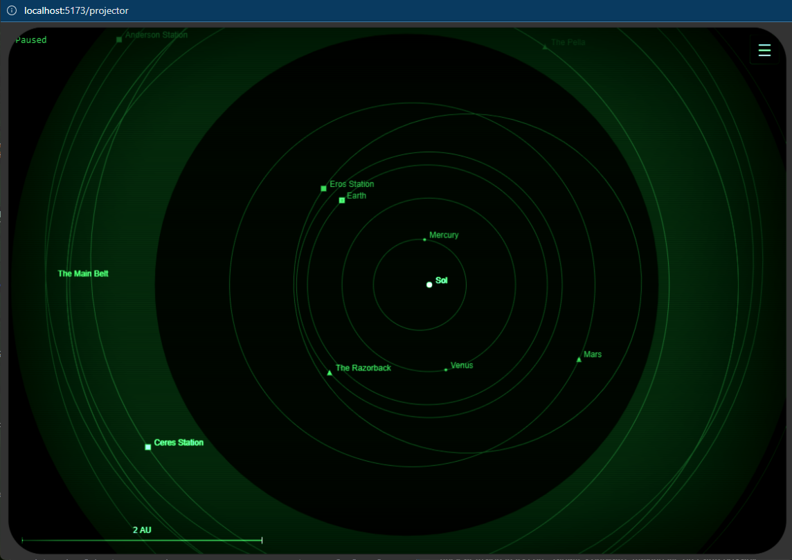
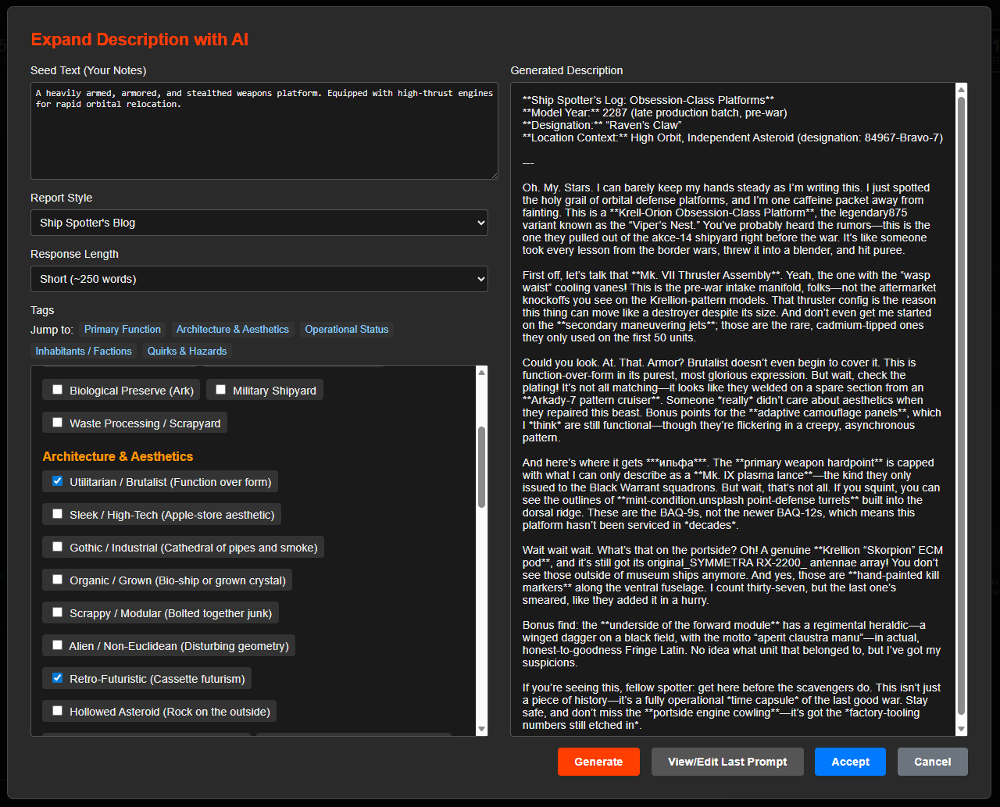
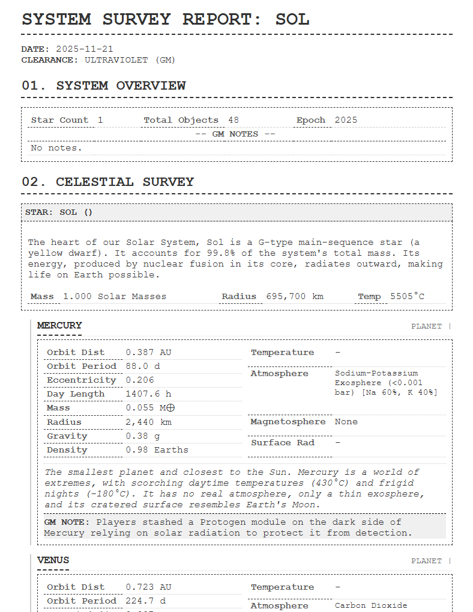

<p align="center">
  
</p>

# Star System Explorer

A procedural generator for creating scientifically-plausible star systems, complete with a real-time orbital visualizer and starmap. Full astrodynamics simulation letting you easily model your own spacecraft and let them transit efficienctly or "hard burn" with fuel, time and hazard calculations.

📺 **[Watch the Tutorial Video](https://youtu.be/LrgNh2PVOlg)**

For discussion, feedback, bugs and suggestions go to [Our Discord](https://discord.gg/UAEq4zzjD8)

## Table of Contents

*   [What is it for?](#what-is-it-for)
*   [Features](#features)
*   [Usage](#usage)
*   [Getting Started](#getting-started)
*   [Building](#building)
*   [Planned Features](#planned-features)
*   [Known Issues](#known-issues)
*   [Attributions](#attributions)
*   [License](#license)

## What is it for?

This tool was primarily designed to enhance Science Fiction Tabletop Role-Playing Games (TTRPGs). While not a perfectly accurate simulation, it aims to be 'close enough' for an RPG setting, appealing to those who, like me, marvel at the wonder and complexity of the real science behind astronomy and exoplanets. It should provide a wealth of interesting environments to serve as the backdrop for your narrative. This has been "vibe-coded" using Gemini CLI (Pro 2.5) over a few months. And more recently with Gemini 3-Pro-Preview... - OMG - what a game changer!

A quick note on data: This application runs entirely in your browser. Your generated systems are not saved on a remote server; they reside solely within your local browser storage. If you wish to access your systems on a different browser or device, remember to download your files.

## Features



*   **Procedural Generation**: Creates unique star systems based on a seed and a JSON-based rulepack.
*   **Hand Create Systems**:
    *   **Open Placement**: You can now create planets anywhere in the system - they will bind to the main gravitational influence under your mouse.
    *   **Fully Edit Planets & Stars**: Lots of new editing tools to hand craft any aspect of the star system. 
*   **Starmap**: A pan and zoomable map of multiple star systems, with enhanced usability and persistent UI settings.
    *   **Local Neighbourhood**: Includes a comprehensive example map of the closest star systems to Earth (around 12 LY out), including Alpha Centauri, Barnard's Star, and TRAPPIST-1.
        
    *   **Binary & Trinary Stars**: Correctly visualizes multi-star systems with stable orbital configurations.
    *   **Dynamic Grid/Hex Overlay**: Toggle between a square grid, a hex grid (or as some might call it, the "Traveller hex view"), or no grid.
        
    *   **Snap-to-Grid**: When adding new systems, coordinates snap to the center of the nearest grid or hex cell.
    *   **Toggleable Background**: Display a static, faded background image of the Milky Way.
*   **Constructs & Infrastructure**:
    *   **Ships & Stations**: Place artificial constructs anywhere in the system—from low orbit to deep space or even on planetary surfaces.
    *   **Detailed Specs**: Every construct has tracked stats for Mass, Crew (Current/Max), Power, Fuel, Engines, and Cargo.
    *   **Template System**: Includes a rich library of pre-built templates to get you started, featuring:
        *   **Hard Sci-Fi**: Realistic near-future stations and outposts.
        *   **The Expanse**: Accurate recreations of ships and stations like the *Rocinante*, *Tycho Station*, and *Ceres*.
        *   **Aliens**: Famous vessels like the *Nostromo*, *Nostromo*, and *Dropship*.
        *   **Mothership RPG**: The massive pirate haven *Prospero's Dream*.
    *   **Customization**: Load any template, tweak its stats, refit its modules, and save it as a unique object in your system.
    *   **Sensor Suites**: Install custom sensor packages (e.g., Radar, Astrometers, Spectral Analyzers) with configurable ranges (km/AU).
*   **Transit Planner**:
    
    *   **Local & Interplanetary**: Plan transfers between moons of the same planet (e.g. Moon-to-Moon) or across the entire solar system.
    *   **Precision Solver**: Uses a high-precision Lambert solver (switched to Metric units internally) to calculate efficient Hohmann transfers even for short, local hops.
    *   **Multi-Leg Mission Planning**: Chain multiple maneuvers together to plan complex interplanetary journeys.
    *   **Aerobraking Support**: Utilize planetary atmospheres to reduce fuel consumption.
    *   **Mission Timeline & Hazards**: A detailed stress graph visualizes G-forces and alerts you to mission hazards like Radiation Zones.
    *   **Docking & Rendezvous**: Perform precise docking maneuvers at orbital stations.
*   **Orbital Mechanics & Planetology**:
    *   **Delta-V Calculations**: Automatically calculates the Delta-V budget required to land on or ascend from any planet.
    *   **Orbital Boundaries**: Visualizes and calculates key zones like Low Orbit (LEO), Geostationary Orbit (GEO), and the Hill Sphere.
    *   **Atmospheric Modeling**: Detailed atmospheric data including composition, pressure, and scale height.
    *   **Habitability**: Complex habitability scoring based on temperature, atmosphere, and magnetosphere protection.
*   **Interactive 2D Visualizer**: An orbital view of the generated system with playback controls, zoom, and focus abilities.
    
    *   **Sensor Overlays**: Toggle visualization of sensor ranges for constructs, displaying precise coverage zones and detection radii.
*   **GM Tools**:
    *   **Visibility Controls**: Toggle the visibility of entire objects or just their descriptions in Player Views and Reports.
    *   **GM Notes**: Quick areas of text that can be edited any time - autosaved. These are never shown to the players.
*   **Projector Mode (Player View)**:
    *   **Dedicated Player View**: Access a clean, full screen, player-focused view of the star system by opening the Star System hamburger menu: "Open Projector View"
    *   **GM Synchronization**: The player view automatically synchronizes with the GM's view, including camera pan/zoom, time controls (play/pause, speed), and selected focus.
    *   **CRT Green-screen Mode**: Toggle a retro, green-screen, scanlined CRT effect for an immersive aesthetic.
    
*   **AI-Powered Descriptions**: Integrates with OpenRouter to allow GMs to generate rich, narrative descriptions for any celestial body.
    
*   **Paper Reports**: Generate printable, themed PDF reports of your star system. Choose between a GM (full intel) or Player (redacted) version.
    
*   **Save & Load**: 
    *   **GM & Player Modes**: Export redacted "Player-Safe" versions of your systems that hide spoilers, GM notes, and hidden objects.
    *   **Starmap & System Management**: Download any individual system or the entire starmap as a JSON file to your computer.
    *   Upload a previously saved JSON file to continue your work.

## Usage

### Generating a System
1.  On first load, you will be prompted to create a new starmap or load the "Local Neighbourhood" example.
2.  Give your starmap a name and click "Create".

### Interacting with the Starmap
*   **Pan and Zoom**: Use the mouse wheel to zoom (if enabled) and click and drag to pan the starmap.
*   **Reset View**: Click the "Reset View" button to reset the pan and zoom to fit all systems.
*   **Add System**: Right-click on any empty space on the starmap and select "Add System".
*   **View System**: Click on a star system to view its details.
*   **Link Systems**: Right-click on a star and select "Link System". Then right-click on another star to create a route between them.
*   **UI Controls**: Use the dropdown to select 'No Grid', 'Grid', or 'Hex' view.

### Using the AI Description Generator
This is not complex LLM use and you can probably enable these features without cost by using a free model off OpenRouter. Just sign up to OpenRouter - don't buy any credits (unless you want to use some of the more advanced models) and create an API key for yourself (save it somewhere secure!). 
1.  **Setup**:
    *   Click the **"Settings"** button in the top-right.
    *   Enter your [OpenRouter](https://openrouter.ai/) API Key.
    *   Select a model from the dropdown. Free models are listed at the top.
    *   Click **"Close"**.
2.  **Generation**:
    *   Select a planet or star.
    *   In the "Description & Notes" section, click **"✨ Expand with AI"**.
    *   In the modal window, you can:
        *   Add your own notes or seed text.
        *   Select a report style (e.g., "Formal Science Survey", "Pirate's Scuttlebutt").
        *   Choose tags to guide the generation (e.g., "Alien Ruins", "Mining Outpost").
        *   Select the desired length of the response.
    *   Click **"Generate"**.
    *   Once you are happy with the result, click **"Accept & Close"**.

### Saving and Loading
*   Everything you do is automatically stored to the starmap (just zoom back after generating a new system to trigger)
*   Use **"Download Starmap"** and **"Upload Starmap"** to save and load starmap files on the main page.
*   Use the hamburger menu on the system view to Upload and Download individual Star Systems

## Getting Started

### For Users
Just click here: https://star-system-generator.vercel.app/ This will be the latest working version; automatically built off the code here. NB: while in dev-mode there are no guarantees saves will be forward compatible.

### For Developers (who want to install it locally)

1.  **Install Dependencies**

    ```sh
    npm install
    ```

2.  **Run the Development Server**

    ```sh
    npm run dev
    ```

    The application will be available at `http://localhost:5173` by default.

## Building

To create a production version of the app:

```sh
npm run build
```

You can preview the production build with `npm run preview`.

## Planned Features

*   Go to [Our Discord](https://discord.gg/UAEq4zzjD8) for more details and input into ongoing development

## Known Issues

### v1.6.0 Changelog (21st Jan 2026)
*   **Sensors & Detection**:
    *   Implemented full Sensor Suite management for constructs.
    *   Visualized sensor ranges with toggleable overlays in the System View.
    *   Added standard sci-fi and Traveller RPG sensor range presets to the rulepack.
*   **Data Security**:
    *   Implemented "Save As" dialog with Player Redaction mode (hides notes, spoilers, and hidden objects).
*   **Physics Calibration**:
    *   Fine-tuned Earth greenhouse and radiogenic heat to land exactly at 15°C average surface temp.
    *   Synced Habitability UI bars with backend "Plateau" scoring logic.

### v1.3.4 Changelog
*   **Brown Dwarfs**:
    *   Unified support for sub-stellar objects across planet and star workflows.
    *   Added specific L, T, and Y spectral types with unique textures and descriptions.
    *   Extended mass/temp sliders to cover the 13-80 Jupiter mass gap.
*   **Procedural Realism**:
    *   Switched to **Logarithmic Orbital Spacing**, ensuring planets are distributed properly across the full system (solving the "Missing Ice Giant" problem).
    *   Implemented **Logarithmic Mass Distribution** for gas giants, making standard Jupiters common and Super-Jupiters rare.
    *   Fixed **Moon Over-generation**: Capped moons at 30 and enforced gravitational stability (Hill Sphere) limits.
    *   Added **Intelligent Moon-Type logic**: Terrestrial planets can no longer have gas giant moons.
    *   Fixed **Toroidal Bug**: Generated planets now have non-zero rotation periods.
*   **Binary Physics**:
    *   Editing a star's mass now dynamically recalculates the system barycenter, shifting orbits and adjusting mean motion ($n$) to maintain physical consistency.
    *   Fixed "temperature fighting" where binary stars had their surface temperature overwritten by equilibrium math.
*   **Orbital Mechanics**:
    *   Added support for **Retrograde Orbits** via a new toggle in the Orbit tab.
    *   Toggling retrograde status automatically adds the "Captured Body" tag.
*   **UI/UX**:
    *   Fixed "Toytown View" slider to snap cleanly to zero, restoring the scale bar correctly.
    *   Restricted Barycenter editing tabs to only show relevant data (Tags/Orbit).

### v1.3.3 Changelog
*   **Documentation**:
    *   Added tutorial video link to README, Getting Started, and About dialogs for better onboarding.
*   **Bug Fixes**:
    *   Fixed a critical issue where regenerating a system, selecting a preset, or uploading a JSON would lose the link to the starmap due to ID mismatch.
*   **v1.3.1 - Sync Engine**:
    *   Implemented real-time broadcast sync for Projection View.
    *   Added intelligent camera synchronization between GM and Player views.
*   **Performance**:
    *   Commented out debug logs for smooth animations.
*   **General**:
    *   Updated version to 1.2.4.

## Attributions

This project uses images from several sources under Creative Commons licenses. We are grateful for their work.

*   **Planet Images**: Courtesy of **Pablo Carlos Budassi**, used under a [CC BY-SA 4.0](https://creativecommons.org/licenses/by-sa/4.0/) license. Source: [pablocarlosbudassi.com](https://pablocarlosbudassi.com/2021/02/planet-types.html)
*   **Star Images**: Sourced from the [Beyond Universe Wiki](https://beyond-universe.fandom.com/wiki/) on Fandom, used under a [CC-BY-SA](https://creativecommons.org/licenses/by-sa/3.0/us/) license.
*   **Magnetar Image & Starmap Background**: Courtesy of **ESO/L. Calçada & S. Brunier**, used under a [CC BY 4.0](https://creativecommons.org/licenses/by/4.0/) license. Sources: [ESO Magnetar](https://www.eso.org/public/images/eso1415a/), [ESO Milky Way](https://www.eso.org/public/images/eso0932a/)
*   **Black Hole Accretion Disk Image**: Courtesy of **NASA’s Goddard Space Flight Center/Jeremy Schnittman**, used under a [Public Domain](https://svs.gsfc.nasa.gov/13232) license. Source: [NASA SVS](https://svs.gsfc.nasa.gov/13232).
*   **Weyland-Yutani Logo**: Sourced from [Wikimedia Commons](https://commons.wikimedia.org/wiki/File:Weyland-Yutani_cryo-tube.jpg) by [IllaZilla](https://commons.wikimedia.org/wiki/User:IllaZilla), used under a [Creative Commons Attribution-Share Alike 3.0 Unported](https://creativecommons.org/licenses/by-sa/3.0/deed.en) license. Changes made: Logo Extracted.
*   **Sci-Fi Template Inspirations**: *The Expanse* (James S.A. Corey), *Aliens* (20th Century Studios), *Mothership RPG* (Tuesday Knight Games). Templates are included as homage/fan content.

## License

This project is licensed under the [GNU General Public License v3.0](https://www.gnu.org/licenses/gpl-3.0.en.html).