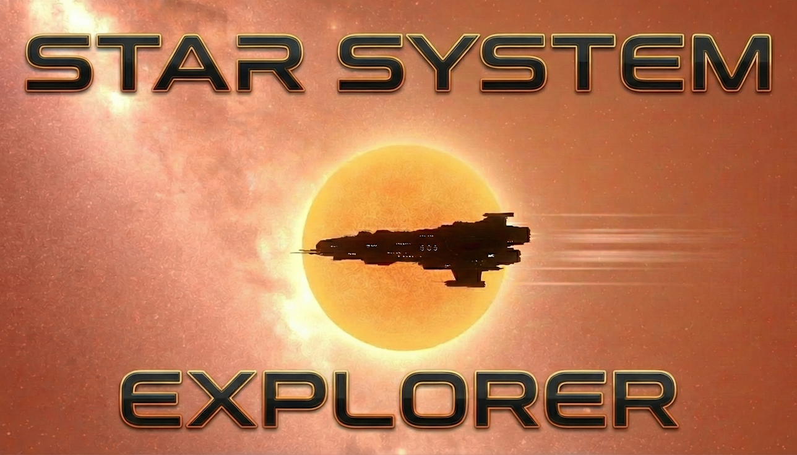
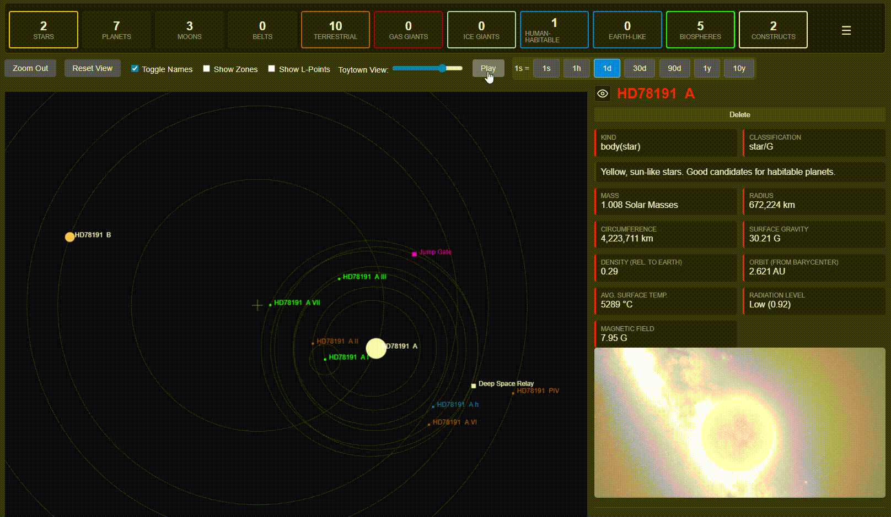
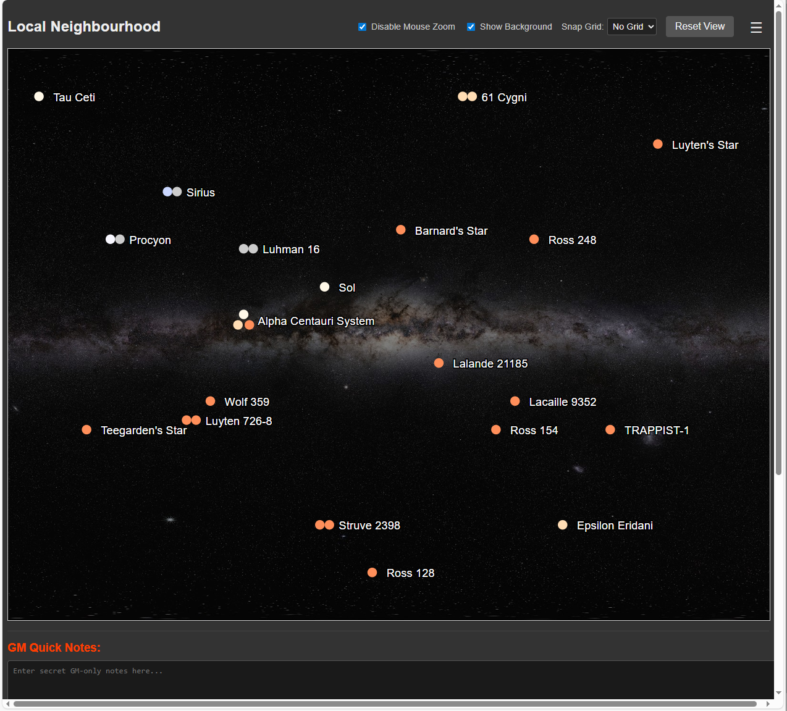
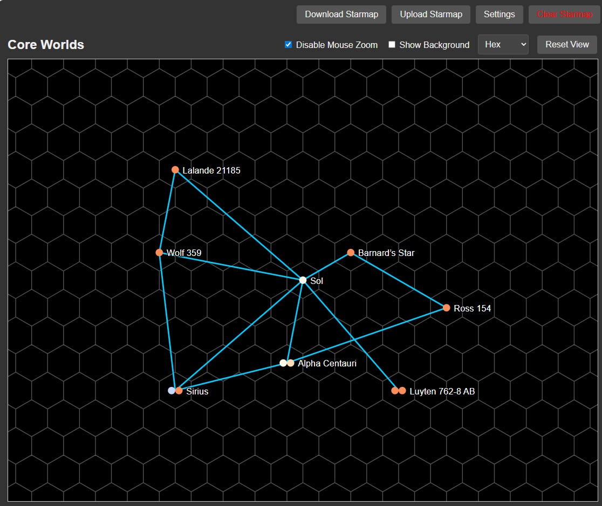
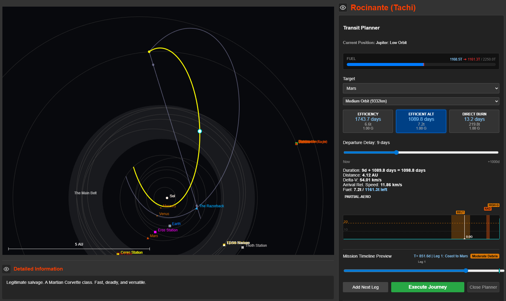
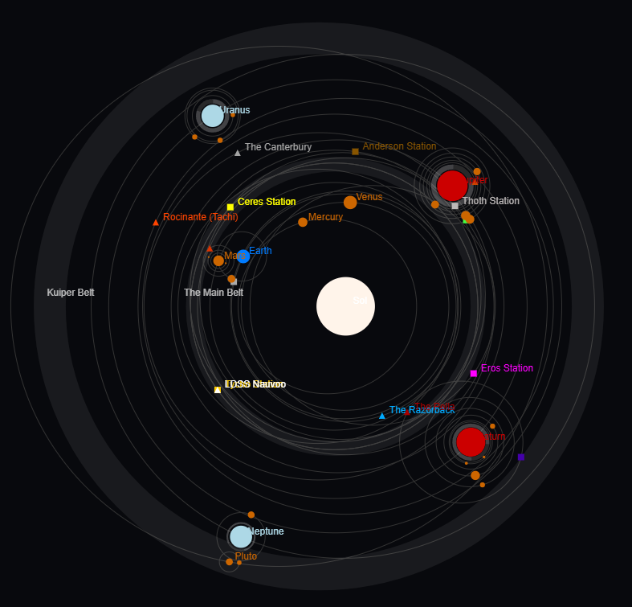
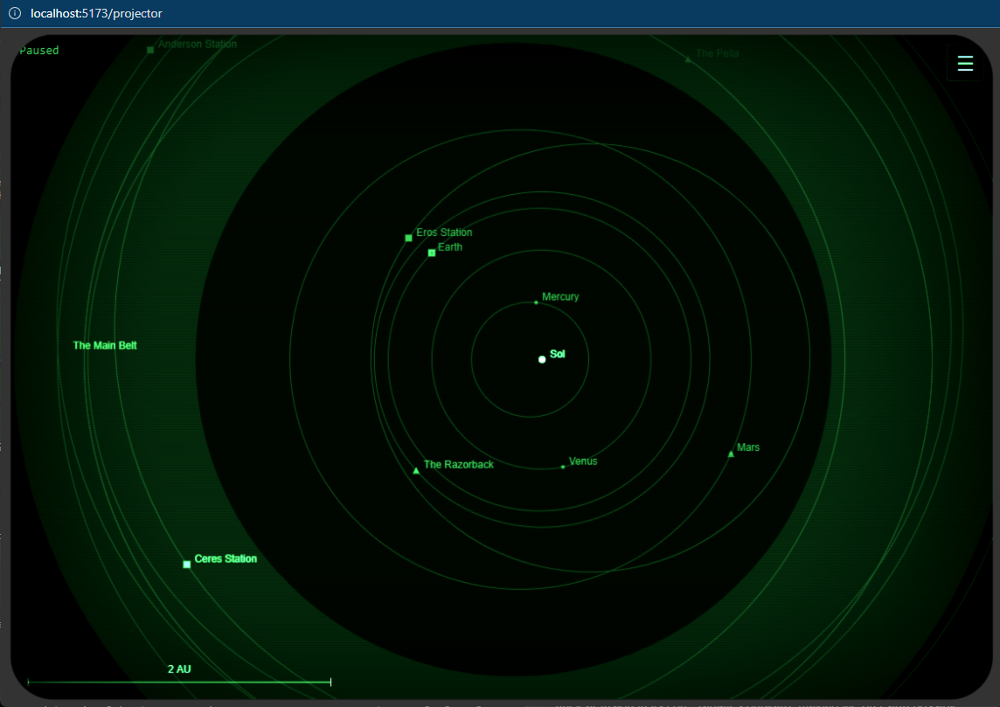
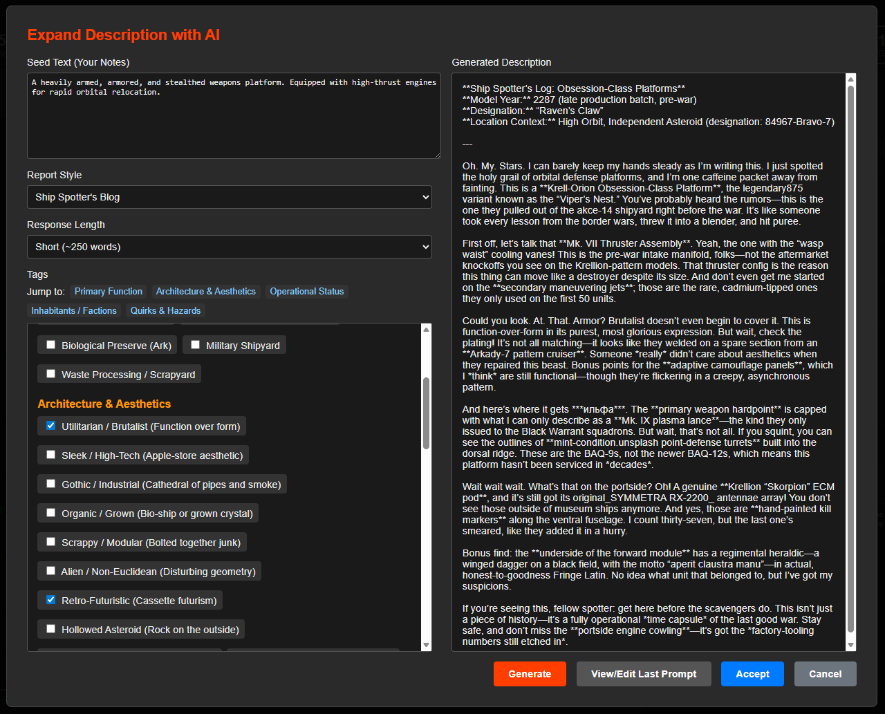
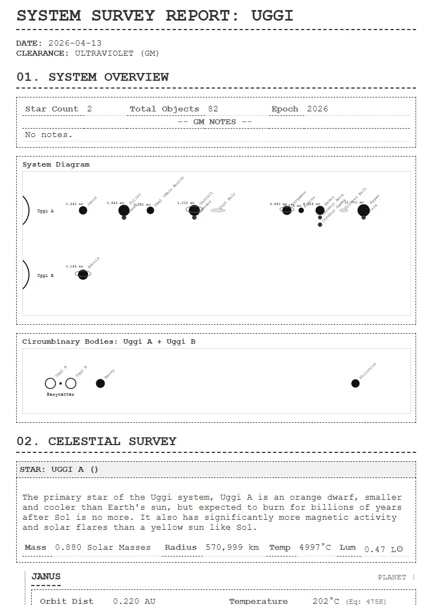

<p align="center">
  
</p>

# Star System Explorer

A procedural generator for scientifically-plausible star systems, with a real-time orbital visualiser, a multi-system starmap, and a full astrodynamics engine for flying your own spacecraft — efficient transfers or hard burns, with fuel, time, relativity and hazard all accounted for. Built for science-fiction tabletop RPGs, and for anyone who marvels at how the real physics fits together.

📺 **[Watch the Tutorial Video](https://youtu.be/LrgNh2PVOlg)**  ·  💬 **[Join the Discord](https://discord.gg/UAEq4zzjD8)** for discussion, feedback, bugs and suggestions.

## Table of Contents

* [What is it for?](#what-is-it-for)
* [What's new in V2](#whats-new-in-v2)
* [Features](#features)
* [Usage](#usage)
* [Getting Started](#getting-started)
* [Building](#building)
* [Changelog](#changelog)
* [Attributions](#attributions)
* [License](#license)

## What is it for?

This tool was built to enhance science-fiction tabletop role-playing games. It isn't a perfect simulation — it aims to be "close enough" for an RPG, while leaning on real astronomy and exoplanet science wherever it can, so the worlds it produces feel like places rather than stat blocks. Crank the sliders and it will still try to keep you on the plausibility rails; open the **Newton panel** on any body and it will show you its full working.

It has been "vibe-coded" over many months across several AI coding assistants — every new model has moved it forward. The physics, however, is calibrated against the real solar system: Sol is the oracle the engine is regression-tested against.

**A note on your data:** the application runs entirely in your browser. Your systems are stored only in your local browser storage — nothing is sent to a server. To move your work to another browser or device, download your files.

## What's new in V2

V2 is a ground-up overhaul. The headline changes:

**A tablet- and phone-friendly UI.** The whole interface was rebuilt around an app shell that works from a 375px phone up to a desktop — collapsible panels, a left rail with Find-by-tag and a Measure tool, and persistent draggable time controls.

**Interstellar travel.** Fly between systems with abstract **Jump** drives or realistic reaction drives, including **relativistic time dilation** — watch crew-frame and observer-frame clocks diverge as you approach light speed. Under-fuelled ships fall short and drift; gravity assists curve real trajectories around destination stars.

**The Field Guide — SSE's companion app.** SSE can now *serve* its data live to your players' own devices, in four skins: a retro monochrome terminal, a clean survey datapad, a starship console with an orbital map, and *The Guide* (hopelessly colourful, DON'T PANIC). All obey the same redaction rules as the printed reports.

**Planetary composition & geology, physically derived.**
- Density now emerges from a metal/rock/carbon/ice/gas interior makeup.
- Liquid and fluid layering — subsurface oceans, surface seas, cloud decks — plus ice caps and ice crusts are modelled.
- Albedo is derived from surface and cloud colour and feeds back into the greenhouse model.
- Magnetic field strength *and* geometry come from a makeup → conductive-layers → dynamo model (so even Mercury gets a tenuous field, and Saturn a suppressed one).
- Tectonics and volcanism follow from physical properties and radiogenic-heat decay.
- Dozens of new **tags** surface all of the above.

**A rebuilt generation system.** Star selection uses a calibrated **Hertzsprung–Russell diagram**; multi-star systems are built as proper **binary hierarchies** (the only ones that are really stable); and stellar & system **age** now shapes belt sizes, atmospheric stripping and tectonic slowdown. Push the sliders and you'll coax out more exotic worlds. Automated star and planet naming, too.

**Tagging promoted to a first-class feature.** Tags now drive roleplay and give players reasons to visit places:
- **Points of Interest (PoI)** — programmatically seeded via a wizard in Settings to add flavour and highlight resources.
- **Constructs of Interest (CoI)** — capability/role tags on ships that engine descriptions read for fuel types, jump-drive range, and so on.
- Manual tagging works properly — invent your own for any purpose and use them in PoI rules.
- Author your own **PoI/CoI packs** to flavour a starmap to your universe: prison colonies on ore-rich moons, a slim chance of alien ruins on any terrestrial — PoIs are your friend.
- **Find by tag…** from the rail — hunt down the nearest gas giant to refuel at, or every world with a breathable atmosphere.

**In-system autopilot.** Give NPC ships standing orders — Mine, Transport, Patrol, Explore, Escort — and they get on with their own lives. Set a ship's *character* (tardy? plans ahead? speed vs efficiency?), and let smart routing find resources, mine and process them, follow a lead ship, and self-refuel and restock. It reads every PoI and CoI tag, so it's endlessly configurable. The **Ship's Log** records everything and is the single source of truth for the physics and time engines — including any construct-to-construct interactions, so players get real flight logs.

**Drifting under gravity.** A ship stopped mid-flight (in-system or interstellar) can coast under no power, at the mercy of gravity — typically looping the sun for ~300 years until Jupiter slings it out to the stars. All the fun.

**Planetary classification overhaul.** 50–60 planet types, classified, visualised and info-linked. Borderline calls show their working so you can reclassify by hand.

**True-colour worlds.** A planet's colour is derived from its star's light, incandescence, surface-liquid refraction, haze/gas and cloud colour. On top of that: volcanic activity, cratering, atmospheric halo, auroras and tidal locking are all visualised, and high rotation visibly **oblates** worlds and smears gas-giant bands.

**The Newton panel — "show the working."** The new apple icon opens a full breakdown of every physics layer's inputs → outputs and the provenance of every tag, each deep-linking into a `/physics` reference page that explains the models, the shortcuts, and the honest fudges.

Plus a long tail: a tape-measure tool, a far richer temperature model (tidal heat now gives a range — Io 90–1500 K rather than a flat +5 K), n-body-aware transits that wiggle and need correction fuel, a **Hill Sphere** view for placing moons, black-hole accretion that drives both radiation and the visible disc, °F/miles unit options, author credits saved into system files, and resonance-aware orbital-stability calculations. See [What actually shipped](#changelog) for the full list.

## Features



* **Procedural & hand generation.** Grow a system from a calibrated HR-diagram star pick, or place bodies anywhere by hand — new planets bind to the dominant gravitational influence under your cursor. Adding a planet offers physically appropriate choices to keep you plausible; you can still edit anything afterwards.
* **Starmap.** A pan-and-zoom map of many systems, with a bundled Local Neighbourhood example (~12 ly out — Alpha Centauri, Barnard's Star, TRAPPIST-1), proper binary/trinary hierarchies, a square/hex/no-grid overlay, snap-to-grid, a toggleable Milky Way backdrop, independent Display/Actual time controls, and data-driven editable calendars.
  
* **Traveller integration.** Import whole subsectors from [travellermap.com](https://travellermap.com), or enter systems by UWP; a dedicated UWP block shows population, starport and political data. A **Traveller Hex** snap mode aligns everything to hexes.
  
* **Constructs & infrastructure.** Place ships and stations anywhere — low orbit to deep space to a planetary surface — each with tracked Mass, Crew, Power, Fuel, Engines, Cargo and Sensors. A rich template library ships (hard sci-fi outposts, *The Expanse*, *Aliens*, *Mothership*); load, refit and save your own. CoI tags let engine and fuel choices drive real capabilities.
* **Transit & interstellar planner.** Lambert-solver transfers for local hops and system-wide journeys, plus interstellar travel with Realistic, Massless, Relativistic and Jump models. Journeys schedule against Display Time and execute as time advances; intercepts target live in-transit position and velocity; a stress graph flags G-forces and radiation.
  
* **Autopilot.** Standing orders for NPC ships — Mine / Transport / Patrol / Explore / Escort — with per-ship character, smart tag-driven routing, self-refuelling, and a full Ship's Log. See the in-app **Autopilot Guide**.
* **Orbital mechanics & planetology.** Δv budgets to land or ascend, orbital boundaries (LEO/GEO/Hill sphere) with a Hill-Sphere view, detailed atmospheres, derived magnetospheres, and resonance-aware stability assessment.
* **Interactive 2D visualiser.** A real-time orbital view with playback, zoom, focus, sensor overlays, and true-colour procedural bodies.
  
* **The Field Guide & Player View.** Serve a live, redacted catalogue to players' devices in four skins, or open a clean full-screen Projector View that syncs to the GM's camera, time and focus — retro CRT effect optional.
  
* **GM tools.** Per-object and per-description visibility controls, autosaved GM notes never shown to players, and Player-Safe exports that strip spoilers.
* **AI-powered descriptions.** Optional OpenRouter integration generates narrative write-ups for any body, guided by style and tags.
  
* **Printable reports.** Themed, printable GM (full intel) or Player (redacted) reports.
  
* **Save, load & customise.** Download or upload individual systems or a whole starmap as JSON; edit rulepacks, atmospheres, fuels/drives and sensor bands globally; upload custom images for bodies and constructs (note: images grow save files considerably).

## Usage

### Generating a system

1. On first load, create a new starmap or load the **Local Neighbourhood** example.
2. Name your starmap and click **Create**. To grow a system, use the generation wizard (pick your star on the HR diagram and go); or right-click empty space to place a system and edit it by hand.

### Interacting with the starmap

* **Pan/zoom** with drag and wheel; **Reset View** fits all systems.
* **Add System** — right-click empty space.
* **View System** — click a star. **Link Systems** — right-click a star, choose Link, then click another.
* **Grid** — switch between No Grid / Grid / Hex from the controls.

### Traveller tools

1. Set the starmap snap mode to **Traveller Hex**.
2. **Bulk import** — right-click the background → *Add Traveller Map SubSector Here*, search a sector (e.g. "Spinward Marches") and pick a subsector.
3. **Manual UWP** — right-click a hex → *Add Traveller UWP Here*, enter the UWP (e.g. `A788899-C`).

### AI descriptions

You can usually enable this for free: sign up at [OpenRouter](https://openrouter.ai/), create an API key, and pick a free model.

1. **Settings** → paste your OpenRouter key → choose a model (free models are listed first).
2. Select a body → **Description & Notes** → **✨ Expand with AI** → set notes, style, tags and length → **Generate** → **Accept & Close**.

### Saving and loading

* Everything autosaves to the starmap. Use **Download / Upload Starmap** on the main page, or the system-view hamburger menu for individual systems.
* Export a **Player-Safe** version to share a spoiler-free copy.

## Getting Started

### For users

Open **https://star-system-generator.vercel.app/** — the latest build, made automatically from this repo. While in active development there's no guarantee saves stay forward-compatible. A short walkthrough lives in [GettingStarted.md](./GettingStarted.md).

### For developers

```sh
npm install     # install dependencies
npm run dev     # dev server at http://localhost:5173
```

Architecture and design notes for contributors live under [`docs/dev/`](./docs/dev/); the physics reference is in-app at `/physics`.

## Building

```sh
npm run build     # production build
npm run preview   # preview the production build
```

## Changelog

For the full release history and version notes, see [changelog.md](./changelog.md).

## Attributions

This project is a collaborative effort of scientific research, community creativity, and open-source assets.

### Special Thanks & Community

* **Community Systems**: Huge thanks to **@Athena**, **@Mafro** & **@malize** from the SSE Discord for contributing example star systems.
* **Accrete.js**: A special thanks to **[Mitch Anderson](https://www.iammitch.com/)** for permission to use his **[Accrete.js](https://github.com/tmanderson/Accrete.js)** code in the new experimental evolutionary system generation.
  * **Scientific Lineage**: The new evolutionary generation engine is built upon the foundational work of: Stephen H. Dole, Carl Sagan, Richard Isaacson, **[Martyn Fogg](https://www.academia.edu/4173808/Extra-Solar_Planetary_Systems_A_Microcomputer_Simulation)**, Matt Burdick, **[Jim Burrows](https://www.eldacur.com/~brons/NerdCorner/StarGen/StarGen.html)** & **[Ian Burrell](https://znark.com/create/accrete.html)**.

### Visual & Media Credits

* **Planet Images**: Courtesy of **Pablo Carlos Budassi**, used under a [CC BY-SA 4.0](https://creativecommons.org/licenses/by-sa/4.0/) license. Source: [pablocarlosbudassi.com](https://pablocarlosbudassi.com/2021/02/planet-types.html)
* **Star Images**: Sourced from the [Beyond Universe Wiki](https://beyond-universe.fandom.com/wiki/) on Fandom, used under a [CC-BY-SA](https://creativecommons.org/licenses/by-sa/3.0/us/) license.
* **Magnetar Image & Starmap Background**: Courtesy of **ESO/L. Calçada & S. Brunier**, used under a [CC BY 4.0](https://creativecommons.org/licenses/by/4.0/) license. Sources: [ESO Magnetar](https://www.eso.org/public/images/eso1415a/), [ESO Milky Way](https://www.eso.org/public/images/eso0932a/)
* **H-R Diagram Background**: Courtesy of **ESO**, used under a [CC BY 4.0](https://creativecommons.org/licenses/by/4.0/) license. Source: [ESO HR Diagram](https://www.eso.org/public/images/eso0728c/).
* **Black Hole Accretion Disk Image**: Courtesy of **NASA's Goddard Space Flight Center/Jeremy Schnittman**, used under a [Public Domain](https://svs.gsfc.nasa.gov/13232) license. Source: [NASA SVS](https://svs.gsfc.nasa.gov/13232).
* **Weyland-Yutani Logo**: Sourced from [Wikimedia Commons](https://commons.wikimedia.org/wiki/File:Weyland-Yutani_cryo-tube.jpg) by [IllaZilla](https://commons.wikimedia.org/wiki/User:IllaZilla), used under a [Creative Commons Attribution-Share Alike 3.0 Unported](https://creativecommons.org/licenses/by-sa/3.0/deed.en) license. Changes made: Logo Extracted.
* **Sci-Fi Template Inspirations**: *The Expanse* (James S.A. Corey), *Aliens* (20th Century Studios), *Mothership RPG* (Tuesday Knight Games). Templates are included as homage/fan content.

## License

This project is licensed under the [GNU General Public License v3.0](https://www.gnu.org/licenses/gpl-3.0.en.html).
