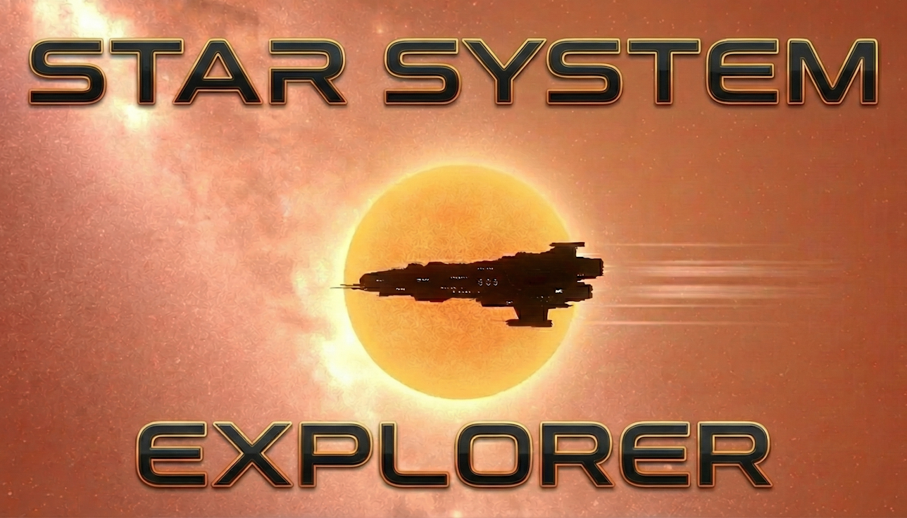
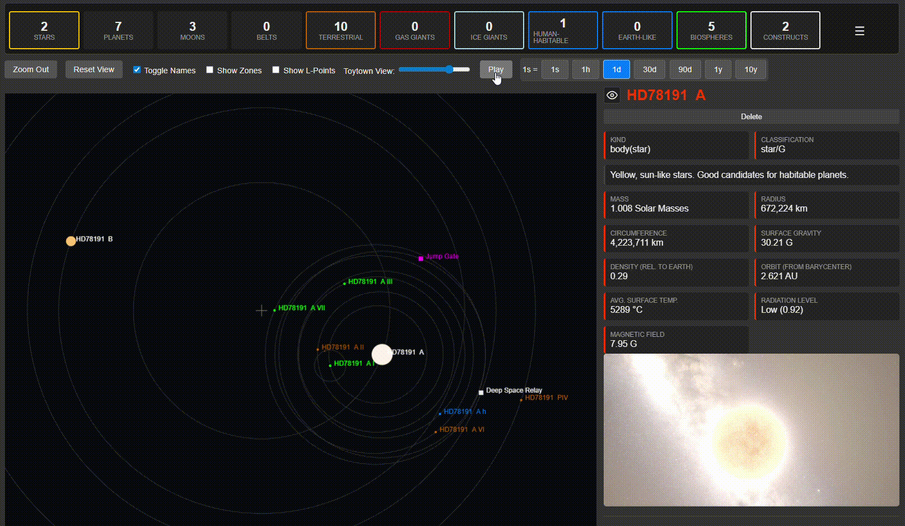
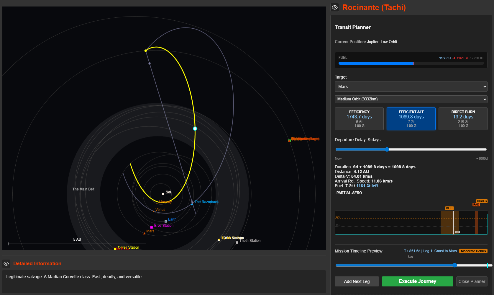

<p align="center">
  
</p>

# Star System Explorer

A procedural generator for scientifically-plausible star systems, with a real-time orbital
visualiser, a multi-system starmap, and a full astrodynamics engine for flying your own spacecraft —
efficient transfers or hard burns, with fuel, time, relativity and hazard all accounted for. Built
for science-fiction tabletop RPGs, and for anyone who marvels at how the real physics fits together.

**[Join the Discord](https://discord.gg/UAEq4zzjD8)** for discussion, feedback, bugs and suggestions.
There is a **[tutorial video](https://youtu.be/LrgNh2PVOlg)** as well, but it is well out of date:
the ideas still hold and almost every screen in it has changed since. Read
[GettingStarted.md](./GettingStarted.md) for the current account.

## Table of Contents

* [What is it for?](#what-is-it-for)
* [What's new in V3](#whats-new-in-v3)
* [Features](#features)
* [Integrating with a virtual tabletop](#integrating-with-a-virtual-tabletop)
* [Usage](#usage)
* [Getting Started](#getting-started)
* [Building](#building)
* [Changelog](#changelog)
* [Attributions](#attributions)
* [License](#license)

## What is it for?

This tool was built to enhance science-fiction tabletop role-playing games. It isn't a perfect
simulation — it aims to be "close enough" for an RPG, while leaning on real astronomy and exoplanet
science wherever it can, so the worlds it produces feel like places rather than stat blocks. Crank
the sliders and it will still try to keep you on the plausibility rails; open the **Newton panel** on
any body and it will show you its full working.

It has been "vibe-coded" over many months across several AI coding assistants — every new model has
moved it forward. The physics, however, is calibrated against the real solar system: Sol is the
oracle the engine is regression-tested against.

**A note on your data.** The application runs in your browser and your campaigns are stored only in
your local browser storage — nothing about a campaign is sent to a server, and to move your work to
another browser or device you download the file. Three things do leave the machine, and it is worth
saying so plainly: searching for a star by name queries the SIMBAD service live, a Traveller
subsector import fetches from travellermap.com (both carry what you typed, not your campaign), and
the hosted site records one anonymous visit event per browser per day through Vercel Web Analytics,
keeping a single timestamp in your browser under `sse-analytics-last-sent` so it does not count you
more often than that. Player views connect peer-to-peer between your device and your players'.

## What's new in V3

V3 is a ground-up rebuild of what a world *is* and of what your table sees. The headlines:

**Player views — the companion app, built in.** SSE serves its data live to your players' own
devices. You design what they see as a **preset** — text list, document, 2D map or the full 3D
system — and dress it with fonts, colours, filters, transitions and your own letterhead. Six presets
ship with it: *The Guide* (hopelessly colourful, DON'T PANIC), a clean *Datapad*, a ship's
*Console*, a green-phosphor *CRT Terminal*, a 3D *Holo Table*, and an overhead *Projection* that
follows the GM's camera and can be dropped onto a greenscreen for OBS. Everything obeys the same
redaction rules as the printed reports, and it updates live as you play. It replaces the old Field
Guide and Projector Mode outright.

**A rewritten physics engine.** What a world is made of decides everything else: density,
temperature, atmosphere and cloud decks, oceans and ice, magnetism, geology, the radiation it throws
out and the colour you actually see. Interiors are a metal/rock/carbon/ice/gas makeup that density
falls out of; liquids layer as subsurface oceans, surface seas and cloud decks; albedo is derived and
feeds back into the greenhouse; magnetic strength *and* geometry come from a conductive-layers dynamo
model. The Newton panel shows the working at every step.

**The light that reaches the ground.** A star's spectrum is filtered by the air and the cloud decks
above it, so what lands on the surface is not what left the star. That light sets the colour of the
land, the sea and the sky, and decides what colour plants would be to grow under it. The physics
pages draw the curve rather than describing it.

**Stand on the surface.** Every world has a **Surface view**: its own ground, sky and light as you
would find them standing on it. A red dwarf's noon does not look like ours — and it answers how far
your players can see, and how far a lamp carries, in metres rather than in adjectives.

**Life is a tag too.** What lives on a world — microbes, fungi, plants, animals, or something that
builds cities — is described the same way everything else is, and it shows on the planet: vegetation
spreads inland from the coast, in a colour worked out from the light that actually reaches it.

**Stars properly classified.** A star's type is read from its **position** — the letter and number
from its temperature, the luminosity class from its size at that temperature — rather than from how
bright it looks, so a supergiant is a supergiant and not a dwarf that happens to share its colour.
Antares imports as the red supergiant it is. Every type is named in plain words with a famous
example, luminosity and ionising output are kept apart because they are different things, and a star
whose numbers break physics is kept and labelled rather than refused.

**Import the real sky.** Build a starmap straight from the astronomy catalogues: the real stars near
you at their true three-dimensional positions, with their confirmed planets — every star in the
region, not only the planet hosts — and, if you want them, plausible worlds filled in around the
rest, tagged so you can always tell what is real. The two bundled starmaps are built this way.

**Starmaps have depth, and stars look like stars.** Systems carry a z-axis, so distances are true in
three dimensions; if you prefer a flat map, everything still works exactly as it did in 2D. Stars are
drawn sharp and true to class, with jets, flares and size by luminosity, and grouped systems hold
together at every zoom. Behind them you can pin **your own map** — a sector map or your empire's
borders — so it holds its place against the stars as you pan and zoom.

**Everything is a tag.** One tagging system throughout: the physics emits tags, you add your own,
override the ones you disagree with, and choose which reach your players. (V2's separate Points of
Interest and Constructs of Interest are gone; everything they did is a tag with a category.)

**3D ships.** Constructs can carry a real hull — upload a GLB, STL or OBJ, or use one of the six
public-domain NASA craft that ship with the app — shown as a turntable in the info block and as a
real craft on the 3D map, with a drive plume scaled to how hard it is burning.

**Undo and redo.** Every step is named, the last twenty survive a reload, and none of it leaves the
room in a shared map.

**A fresh face for the GM view.** Four interface skins (including a colour-blind-friendly one) and a
skin editor to make your own; click any unit to swap it, and every reading of that kind on that body
type follows, with your players inheriting your choice.

**Bring your worlds in.** Traveller, Universe Sandbox and SpaceEngine imports, unified onto one
generator, with the same four flavour dials filling out every system.

Plus the long tail: eclipse times on every moon, weather and lightning, aurorae, stellar flares and
the dose they deliver, a Memory panel and a diagnostic bundle for when something goes wrong, and
several hundred smaller changes. See the [changelog](./changelog.md) for every one, build by build,
and [GettingStarted.md](./GettingStarted.md) for how to use them.

## Features



* **Procedural and hand generation.** Grow a system from a calibrated HR-diagram star pick, with four
  dials — metallicity, disc mass, dynamical history and rarity — each carrying a green/amber/red
  band saying how unusual that setting is without ever forbidding it. Or place bodies anywhere by
  hand: new planets bind to the dominant gravitational influence under your cursor, and the picker
  offers the types that are actually viable at that orbit, with every gate a switch you can turn off.
  
* **Starmap.** A pan-and-zoom map of many systems in three dimensions, with two bundled examples
  built from real astronomy, proper binary and trinary hierarchies, square/hex/subsector/Traveller
  grids, snap-to-grid, your own image pinned behind the stars, independent Display/Actual time
  controls, and data-driven editable calendars.
  
* **Real-sky import.** Four region presets or a centre and radius of your choosing, drawn from the
  NASA Exoplanet Archive and SIMBAD, into a new map or into one you already have.
* **Traveller integration.** Import whole subsectors from [travellermap.com](https://travellermap.com),
  or enter systems by UWP; a dedicated UWP block shows population, starport and political data.
  **Traveller mode** (Settings → Starmap) aligns everything to hexes. Companion stars are placed by
  the same planner the generator uses, because the sector format carries no companion orbits.
  
* **Import from Universe Sandbox and SpaceEngine.** Drop a `.ubox` save or a `.sc` export into the
  New system wizard and it converts into a playable system — bodies, orbits, composition and
  atmospheres come across, and SSE derives the rest of the physics. A mass slider controls how many
  small bodies to bring in, and an Import Review shows anything SSE derived differently from the
  source, with one-click copy.
* **Constructs and infrastructure.** Place ships and stations anywhere — low orbit to deep space to a
  planetary surface — each with tracked mass, crew, power, fuel, engines, cargo and sensors, and
  optionally a real 3D hull. A rich template library ships (hard sci-fi outposts, *The Expanse*,
  *Aliens*, *Mothership*); load, refit and save your own.
* **Transit and interstellar planner.** Lambert-solver transfers for local hops and system-wide
  journeys, plus interstellar travel with Realistic, Massless, Relativistic and Jump models. Journeys
  schedule against Display Time and execute as time advances; intercepts target live in-transit
  position and velocity; a stress graph flags G-forces and radiation.
  
* **Autopilot.** Standing orders for NPC ships — Mine / Transport / Patrol / Explore / Escort — with
  per-ship character, smart tag-driven routing, self-refuelling, and a full Ship's Log. See the
  in-app **Autopilot Guide**.
* **Orbital mechanics and planetology.** Δv budgets to land or ascend, orbital boundaries
  (LEO/GEO/Hill sphere) with a Hill-sphere view, Lagrange points, the stellar zones drawn and
  explained — Roche limit, rock and soot lines, habitable zone, both frost lines, the CO₂ ice line —
  detailed atmospheres, derived magnetospheres, next-eclipse times, and resonance-aware stability.
  
* **Planetary classification.** 50-60 planet types, each fingerprinted on the parameter bands that
  define it, visualised and info-linked. A borderline call shows its working and can be reclassified
  by hand, and a pinned type survives save and reload.
* **True-colour worlds.** A planet's colour is derived from its star's light, incandescence,
  surface-liquid refraction, haze and cloud colour. On top of that: volcanic activity, cratering,
  atmospheric halo, auroras and tidal locking are all visualised, and a fast rotator visibly
  **oblates** and smears its gas-giant bands.
* **The Newton panel — "show the working".** The apple icon opens a full breakdown of every physics
  layer's inputs and outputs and the provenance of every tag, each deep-linking into a `/physics`
  reference that explains the models, the shortcuts, and the honest fudges.
* **Drifting under gravity.** A ship stopped mid-flight, in-system or interstellar, can coast under
  no power at the mercy of gravity — typically looping the sun for centuries until a planet slings it
  out to the stars.
* **Built for a table, not a desk.** The interface works from a 375px phone up to a desktop:
  collapsible panels, a left rail, and floating on-canvas controls that fold away to a puck when you
  touch something else, so a tablet screen stays clear.
* **Interactive 2D visualiser.** A real-time orbital view with playback, zoom, focus, sensor
  overlays, and true-colour procedural bodies; every world offers up to five views of itself, from
  the artist's impression to standing on its surface.
* **Player views.** Serve a live, redacted view to players' devices — designed as a preset and
  deployed to phones, tablets or a second screen by link or QR code — or run the overhead Projection
  preset, which follows the GM's camera, time and focus.
  
* **GM tools.** Per-object and per-description visibility controls, autosaved GM notes never shown to
  players, secret tags, undo and redo, and Player-Safe exports that strip spoilers.
* **AI-powered descriptions.** Optional OpenRouter integration generates narrative write-ups for any
  body, guided by style and tags.
  
* **Printable reports.** Themed, printable GM (full intel) or Player (redacted) reports.
  
* **Save, load and customise.** Download or upload individual systems or a whole starmap: plain JSON
  when there are no assets, and a readable `.sse.zip` bundle when there are, carrying an
  `ATTRIBUTIONS.md` that credits every model and picture inside it. Edit rule packs, atmospheres,
  liquids, biospheres, fuels and drives, and sensor bands globally; upload custom images for bodies,
  stars and constructs.

## Integrating with a virtual tabletop

SSE can appear inside another application as a live, redacted view of your campaign. This is early,
and this section describes what exists rather than what is planned.

**[Mappadux](https://www.mappadux.com)** — free, and built alongside this — works today: your starmap
and systems appear on the table, live, as a StarMap map kind.

Two hosted routes make that possible, and a host app that wants to do the same uses them:

* **`/bridge`** is a hidden discovery frame. A host app embeds it, and it asks the GM's SSE tab in
  the same browser "who is here", relaying the answer to its parent over `postMessage`. Frames carry
  `{ns: 'sse2-bridge', v: 1}`; the parent sends `hello` and `ensureRemote`, and the bridge answers
  `ready`, `announce`, `gone`, `ok` or `error` — and forwards unsolicited announces, which is how a
  host's "open SSE, then auto-resume" flow completes. **It is read and relay only.** It exposes the
  starmap's identity and its player-view names — what anyone holding the session id could learn
  anyway — and can ask the GM tab to start hosting. It cannot read the campaign and cannot change
  anything.
* **`?embed=1`** on a player view strips the surrounding chrome so the view sits cleanly in a frame,
  and accepts `{ns: 'sse2-embed', v: 1}` commands from its parent — `ping`, and `setPreset` to switch
  between presets on one warm iframe without a reload.

Underneath, discovery uses the same broadcast plumbing the player views do: `REQUEST_HELLO`,
`ANNOUNCE`, `REQUEST_REMOTE` and `SYNC_HEARTBEAT`. Two things are worth knowing before you build
against it. **Parent origins are allowlisted exactly** (`src/lib/embedOrigins.ts`) — Mappadux's
domains plus localhost for development — so a new host app has to be added there before it can drive
an embedded surface; a wildcard would hand a discovery surface to any page that framed us. And
**BroadcastChannel is partitioned inside a third-party iframe** by top-level site, so a cross-site
host cannot hear the SSE tab over it and must discover over PeerJS with a known session id, with the
first pairing always a pasted player link. Local development never shows this, because two localhost
ports are one site.

Foundry VTT and Owlbear Rodeo shims are wanted and not written. If you run either, come and say so on
the Discord — the design notes live in `docs/dev/vtt-integration-design.md`.

Players see one change from all of this: the LIVE/OFFLINE pill on a player view goes OFFLINE when the
GM stops sharing, where it used to stick.

## Usage

### Generating a system

1. On first load, create a new starmap, load one of the bundled examples, or import a region of the
   real sky.
2. To grow a system, right-click empty space and choose **Add System Here**: pick your star or stars
   on the HR diagram, then set the age and the four character dials.

### Interacting with the starmap

* **Pan/zoom** with drag and wheel (pinch on touch); **Reset View** fits all systems.
* **Add System** — right-click empty space. **Add System near here…** — right-click a system, to
  place one by bearing, elevation and distance.
* **View System** — click a star. **Link Systems** — right-click a star, choose Start Link, then
  click another.
* **Grid** — Settings → Starmap → Snap grid: None, Square, Hex, Subsector hex or Traveller hex.

### Traveller tools

1. Enable **Traveller mode** under **Settings → Starmap** to align the map to hexes.
2. **Bulk import** — right-click the background, choose *Add Traveller Map SubSector Here*, search a
   sector (e.g. "Spinward Marches") and pick a subsector.
3. **Manual UWP** — right-click a hex, choose *Add Traveller UWP Here*, and enter the UWP (e.g.
   `A788899-C`).

### AI descriptions

You can usually enable this for free: sign up at [OpenRouter](https://openrouter.ai/), create an API
key, and pick a free model.

1. **Settings → System → LLM Settings** — paste your OpenRouter key and choose a model (free models
   are listed first).
2. Select a body → **Description & Notes** → **Expand with AI** → set notes, style, tags and length →
   **Generate** → **Accept & Close**.

### Saving and loading

* Everything autosaves to this browser. Use **File → Download / Upload** on the starmap, or the
  system view's File menu for individual systems. Saving to a file is the only real backup.
* Export a **Player-Safe** version to share a spoiler-free copy.

## Getting Started

### For users

Open **https://starsystemx.com/** — the live app. For the newest features ahead of release there is a
**beta channel** at **https://beta.starsystemx.com/**; while it is in active development there is no
guarantee beta saves stay forward-compatible. A full walkthrough lives in
[GettingStarted.md](./GettingStarted.md).

### For developers

```sh
npm install     # install dependencies
npm run dev     # dev server at http://localhost:5173
```

Architecture and design notes for contributors live under [`docs/dev/`](./docs/dev/); the physics
reference is in-app at `/physics`, and the tag model is in
[`docs/tags-guide.md`](./docs/tags-guide.md) and
[`docs/classification-and-tags.md`](./docs/classification-and-tags.md).

## Building

```sh
npm run build     # production build
npm run preview   # preview the production build
```

## Changelog

For the full release history and version notes, see [changelog.md](./changelog.md).

## Attributions

This project is a collaborative effort of scientific research, community creativity, and open-source
assets.

### Special Thanks & Community

* **Community Systems**: Huge thanks to **@Athena**, **@Mafro** & **@malize** from the SSE Discord for
  contributing example star systems.
* **Accrete.js**: A special thanks to **[Mitch Anderson](https://www.iammitch.com/)** for permission
  to use his **[Accrete.js](https://github.com/tmanderson/Accrete.js)** code. The experimental
  accretion generator it powered has moved out of this app and into a project of its own,
  **[System Lab](https://system-lab.starsystemx.com/)**, where it can grow at its own pace.
  * **Scientific Lineage**: That work was in turn built on the foundational work of: Stephen H. Dole,
    Carl Sagan, Richard Isaacson,
    **[Martyn Fogg](https://www.academia.edu/4173808/Extra-Solar_Planetary_Systems_A_Microcomputer_Simulation)**,
    Matt Burdick, **[Jim Burrows](https://www.eldacur.com/~brons/NerdCorner/StarGen/StarGen.html)** &
    **[Ian Burrell](https://znark.com/create/accrete.html)**.

### Astronomy Data

* **NASA Exoplanet Archive**, operated by the California Institute of Technology under contract with
  NASA under the Exoplanet Exploration Program — the confirmed-planet set behind the real-sky import
  and the bundled starmaps. A snapshot ships with the app.
* **[SIMBAD](https://simbad.cds.unistra.fr/simbad/)**, operated at CDS, Strasbourg, France — star
  identification and astrometry; star-name resolution queries it live.
* **S-star orbital elements**: Gillessen et al. 2017, refined by the GRAVITY Collaboration.

### Visual & Media Credits

* **Planet Images**: Courtesy of **Pablo Carlos Budassi**, used under a [CC BY-SA 4.0](https://creativecommons.org/licenses/by-sa/4.0/) license. Source: [pablocarlosbudassi.com](https://pablocarlosbudassi.com/2021/02/planet-types.html)
* **Star Images**: Sourced from the [Beyond Universe Wiki](https://beyond-universe.fandom.com/wiki/) on Fandom, used under a [CC-BY-SA](https://creativecommons.org/licenses/by-sa/3.0/us/) license.
* **Magnetar Image & Starmap Background**: Courtesy of **ESO/L. Calçada & S. Brunier**, used under a [CC BY 4.0](https://creativecommons.org/licenses/by/4.0/) license. Sources: [ESO Magnetar](https://www.eso.org/public/images/eso1415a/), [ESO Milky Way](https://www.eso.org/public/images/eso0932a/)
* **H-R Diagram Background**: Courtesy of **ESO**, used under a [CC BY 4.0](https://creativecommons.org/licenses/by/4.0/) license. Source: [ESO HR Diagram](https://www.eso.org/public/images/eso0728c/).
* **Black Hole Accretion Disk Image**: Courtesy of **NASA's Goddard Space Flight Center/Jeremy Schnittman**, used under a [Public Domain](https://svs.gsfc.nasa.gov/13232) license. Source: [NASA SVS](https://svs.gsfc.nasa.gov/13232).
* **Starter Spacecraft Models** (ISS, Hubble, Cassini-Huygens, Juno, Voyager, Mars Reconnaissance Orbiter): Courtesy of **NASA**, public domain. Source: [NASA 3D Resources](https://github.com/nasa/NASA-3D-Resources). Textured models resampled to 512 px for bundle size. The NASA insignia is protected and is not used.
* **Save Bundles**: campaign and system saves are zip containers (`.sse.zip`) holding a readable `starmap.json`/`system.json` beside `assets/models/*.glb` and `assets/images/*` — hand-editable, and a third smaller than embedding the same assets as base64. Plain `.json` saves are still written when a campaign has no assets, and both load either way (the loader sniffs the zip magic number, not the file name).
* **3D Model Pipeline**: [three.js](https://threejs.org/) (MIT) for rendering and GLB/STL/OBJ loading; [meshoptimizer](https://github.com/zeux/meshoptimizer) (MIT) for import-time simplification of high-poly meshes; Google's [Draco](https://github.com/google/draco) decoder (Apache-2.0, bundled from three.js's distribution) for compressed models.
* **Weyland-Yutani Logo**: Sourced from [Wikimedia Commons](https://commons.wikimedia.org/wiki/File:Weyland-Yutani_cryo-tube.jpg) by [IllaZilla](https://commons.wikimedia.org/wiki/User:IllaZilla), used under a [Creative Commons Attribution-Share Alike 3.0 Unported](https://creativecommons.org/licenses/by-sa/3.0/deed.en) license. Changes made: Logo Extracted.
* **Sci-Fi Template Inspirations**: *The Expanse* (James S.A. Corey), *Aliens* (20th Century Studios), *Mothership RPG* (Tuesday Knight Games). Templates are included as homage/fan content.

## License

This project is licensed under the [GNU General Public License v3.0](https://www.gnu.org/licenses/gpl-3.0.en.html).
